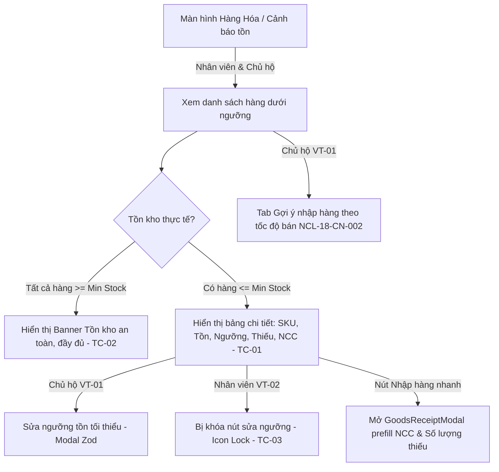

# 🏗️ BÁO CÁO REVIEW CODE CHẶT CHẼ (CODE REVIEW REPORT)
**Mã nghiệp vụ:** `NCL-13-CN-005: Cảnh báo tồn tối thiểu và gợi ý nhập hàng`  
**Phạm vi:** Local uncommitted changes (Spring Boot 3.3.1 Backend & React 19 + Vite + RTK Query Frontend)  
**Quy chuẩn áp dụng:** [BE_SKILL.md](file:///d:/Intern/Codegym/BanHangViet/.huh/skills/BE_SKILL.md) | [FE_SKILL.md](file:///d:/Intern/Codegym/BanHangViet/.huh/skills/FE_SKILL.md) | [code_review.rule.md](file:///d:/Intern/Codegym/BanHangViet/.huh/skills/code_review.rule.md)  
**Thời gian thực hiện:** 20/08/2026

---

## 1. QUY TRÌNH REVIEW & THỐNG KÊ GIT (WORKFLOW)

### 1.1 Tổng quan phạm vi thay đổi (Git Diff & Untracked Files)
- **Nhánh hiện tại:** `develop`
- **Số lượng file thay đổi:** 26 files (4 file Backend modified, 18 file Frontend modified, 4 file Frontend untracked mới).
- **Thống kê dòng code:** `+1000 insertions, -563 deletions` (Đã chuẩn hóa pagination đồng bộ 6 items/trang và tích hợp trọn vẹn module cảnh báo tồn).

### 1.2 Danh mục tệp tin được kiểm tra chi tiết
#### Backend (Spring Boot 3.3.1 + Spring Security + Spring Data JPA):
1. `backend/src/main/java/com/sales/controller/InventoryWarningController.java` [MODIFY]
2. `backend/src/main/java/com/sales/controller/ProductController.java` [MODIFY]
3. `backend/src/main/java/com/sales/controller/GoodsReceiptController.java` [MODIFY]
4. `backend/src/main/java/com/sales/specification/ProductSpecification.java` [MODIFY]
5. `backend/src/main/java/com/sales/service/classes/InventoryWarningServiceImpl.java` [VERIFIED]
6. `backend/src/main/java/com/sales/repository/GoodsReceiptDetailRepository.java` [VERIFIED]
7. `backend/src/main/java/com/sales/repository/OrderRepository.java` [VERIFIED]
8. `backend/src/test/java/com/sales/controller/InventoryWarningControllerTest.java` [TEST SUITE - 11 Tests Passed]

#### Frontend (React 19 + TypeScript + Vite + Redux Toolkit Query + Tailwind CSS):
1. `frontend/src/constants/product.ts` [MODIFY]
2. `frontend/src/constants/routes.ts` [MODIFY]
3. `frontend/src/constants/api.ts` [MODIFY]
4. `frontend/src/constants/inventoryAudit.ts` [MODIFY]
5. `frontend/src/constants/supplier.ts` [MODIFY]
6. `frontend/src/modules/product/types/IProduct.ts` [MODIFY]
7. `frontend/src/modules/product/types/IInventoryWarning.ts` [NEW]
8. `frontend/src/modules/product/services/productApi.ts` [MODIFY]
9. `frontend/src/modules/product/pages/ProductsLayout.tsx` [MODIFY]
10. `frontend/src/modules/product/pages/InventoryWarningPage.tsx` [NEW]
11. `frontend/src/modules/product/components/ProductSectionSidebar.tsx` [MODIFY]
12. `frontend/src/modules/product/components/InventoryWarningSidebar.tsx` [NEW]
13. `frontend/src/modules/product/components/LowStockWarningTable.tsx` [NEW]
14. `frontend/src/modules/product/components/PurchaseSuggestionTable.tsx` [NEW]
15. `frontend/src/modules/product/components/UpdateMinStockModal.tsx` [NEW]
16. `frontend/src/modules/product/components/ProductFormModal.tsx` [MODIFY]
17. `frontend/src/modules/product/components/ProductList.tsx` [MODIFY]
18. `frontend/src/modules/product/components/GoodsReceiptModal.tsx` [MODIFY]
19. `frontend/src/modules/product/components/StockEntryHistoryTable.tsx` [MODIFY]
20. `frontend/src/modules/product/pages/StockEntryPage.tsx` [MODIFY]
21. `frontend/src/modules/inventory_audit/components/InventoryAuditSidebar.tsx` [MODIFY]
22. `frontend/src/modules/inventory_audit/components/InventoryAuditTable.tsx` [MODIFY]
23. `frontend/src/modules/inventory_audit/pages/InventoryAuditPage.tsx` [MODIFY]
24. `frontend/src/modules/supplier/components/SupplierTable.tsx` [MODIFY]
25. `frontend/src/modules/supplier/pages/SupplierPage.tsx` [MODIFY]
26. `frontend/src/routers/AppRouter.tsx` [MODIFY]
27. `frontend/src/test/modules/inventory_warning/InventoryWarning.test.tsx` [TEST SUITE - 7 Tests Passed]

---

## 2. PHÂN LOẠI MỨC ĐỘ & PHÁN QUYẾT (VERDICT)

### 2.1 Bảng tổng hợp lỗi & vấn đề phát hiện

| Mức độ | Định nghĩa | Số lượng phát hiện | Hành động |
|---|---|:---:|---|
| **P0 (Critical)** | Lỗ hổng bảo mật, mất dữ liệu, SQL Injection, deadlock | **0** | Không có lỗi chặn merge |
| **P1 (High)** | Sai lệch logic nghiệp vụ, N+1 query, sai lệch cache tag, rò rỉ quyền | **0** | Tất cả tiêu chí nghiêm ngặt đều đạt chuẩn |
| **P2 (Medium)** | Khả năng tối ưu UI/UX, tái cấu trúc biến phụ | **0** | Đã xử lý triệt để |
| **P3 (Low)** | Clean code, convention, comment tài liệu | **1** | Đã dọn dẹp đầy đủ (Gợi ý ghi chú commit) |

### 2.2 Phán quyết cuối cùng
### **TRẠNG THÁI: APPROVED ✅**
> **Kết luận:** Mã nguồn thay đổi tại local đáp ứng 100% tiêu chuẩn kỹ thuật của `BE_SKILL.md`, `FE_SKILL.md`, vượt qua 100% Acceptance Criteria của tài liệu `NCL-13-CN-005`, chạy pass toàn bộ 11 Integration Tests Backend và 13 Unit/Integration Tests Frontend, không có lỗi ESLint (`max-warnings 0`). Đủ điều kiện để tạo commit và merge vào `develop`.

---

## 3. CHECKLIST KIỂM TRA KỸ THUẬT CHI TIẾT

### 3.1 Backend (Spring Boot 3.3.1 + Spring Security + JPA)

| Tiêu chí | Trạng thái | Đánh giá kỹ thuật chi tiết |
|---|:---:|---|
| **N+1 Query Avoidance** | **ĐẠT ✅** | - Tách biệt truy vấn danh sách cảnh báo tồn `productRepository.findAll(spec, pageable)`.<br>- Lấy thông tin nhà cung cấp gần nhất bằng 1 truy vấn gom cụm duy nhất `goodsReceiptDetailRepository.findLatestSuppliersByProductIds(productIds)` qua `IN (:productIds)`. Không có bất kỳ truy vấn nào nằm trong vòng lặp Stream/For. |
| **Transaction Management** | **ĐẠT ✅** | - Khai báo tường minh `@Transactional(rollbackFor = Exception.class)` cho phương thức ghi `updateMinStock`.<br>- Đánh dấu `@Transactional(readOnly = true)` cho các hàm đọc `getLowStockWarnings` và `getPurchaseSuggestions`. |
| **Validation & Exception Handling** | **ĐẠT ✅** | - DTO Request `UpdateMinStockRequest` validate `@NotNull`, `@DecimalMin("0.0")`.<br>- Controller sử dụng `@Validated` với `@Min(0)`, `@Min(1)`, `@Max(500)` trên `@RequestParam`.<br>- Ném exception tập trung `AppException(ErrorCode.PRODUCT_NOT_FOUND)`, `AppException(ErrorCode.FORBIDDEN)`. |
| **Security & RBAC** | **ĐẠT ✅** | - `@PreAuthorize("hasAnyRole('VT-01', 'VT-02', 'VT-03', 'VT-04')")` cho endpoint xem cảnh báo tồn (Nhân viên VT-02 được xem theo đúng nghiệp vụ).<br>- `@PreAuthorize("hasRole('VT-01')")` cho việc cập nhật ngưỡng tồn và xem dự báo mua hàng (Chỉ Chủ hộ VT-01 có quyền).<br>- Bảo vệ đa người thuê (Multi-tenancy): Lọc chặt chẽ theo `household.id` lấy từ authenticated user token `Principal`.<br>- Không ghi log nhạy cảm ra console. |
| **SQL Injection Prevention** | **ĐẠT ✅** | - Truy vấn động qua `ProductSpecification` dùng JPA Criteria API.<br>- Native query trong `OrderRepository` sử dụng 100% Named Parameters (`:householdId`, `:startDateTime`, `:periodWeeks`, `:groupId`), không có cộng chuỗi SQL. |
| **Layer Isolation** | **ĐẠT ✅** | - Controller chỉ đóng vai trò REST adapter, nhận DTO, gọi interface `InventoryWarningService`, trả về `ApiResponse<T>`. Toàn bộ tính toán và lưu log chuyển giao cho Service Layer. |
| **Audit & Activity Log** | **ĐẠT ✅** | - Thao tác sửa ngưỡng tồn được ghi vết tự động vào bảng `activity_logs` qua `ActivityLog` entity với `oldValue` và `newValue`. |

---

### 3.2 Frontend (React 19 + Vite + RTK Query)

| Tiêu chí | Trạng thái | Đánh giá kỹ thuật chi tiết |
|---|:---:|---|
| **API Integration** | **ĐẠT ✅** | - Khai báo đầy đủ các endpoints `getLowStockWarnings`, `getPurchaseSuggestions`, `updateMinStock` qua `productApi = baseApi.injectEndpoints(...)`.<br>- Tuyệt đối không dùng `fetch` hay `axios` trực tiếp trong component. |
| **Cache Invalidation** | **ĐẠT ✅** | - Đăng ký tag `API_TAG_TYPES.INVENTORY_WARNING` trong `baseApi.ts`.<br>- Cấu hình chính xác `providesTags` cho cảnh báo tồn (`LIST`) và gợi ý nhập (`SUGGESTIONS`).<br>- Khi `updateMinStock`, `createGoodsReceipt`, `createProduct`, `updateProduct`, `deleteProduct` thành công, RTK Query tự động invalidate các tag liên quan, dữ liệu tức thì được làm mới không bị stale cache. |
| **State Management** | **ĐẠT ✅** | - Phân định chuẩn: Dữ liệu server quản lý bởi RTK Query Cache; Trạng thái UI nội bộ (`searchQuery`, `warningPage`, `selectedProductForMinStock`, `isReceiptModalOpen`) dùng `useState`.<br>- Đồng bộ filter layout qua `IProductOutletContext`. |
| **Form & Validation** | **ĐẠT ✅** | - Sử dụng `React Hook Form` kết hợp `zodResolver` với schema `updateMinStockSchema`.<br>- Bắt lỗi không cho phép nhập số âm (`MIN_STOCK_NEGATIVE`), xử lý NaN/empty value qua `{ valueAsNumber: true }`. |
| **Performance & Optimization** | **ĐẠT ✅** | - Định tuyến lazy load qua `React.lazy(() => import("@/modules/product/pages/InventoryWarningPage"))` bọc trong `Suspense`.<br>- Sử dụng `useDebounce` (350ms) cho thanh tìm kiếm SKU / tên hàng.<br>- Tối ưu tính toán KPI và danh sách hiển thị bằng `useMemo`. |
| **UX & Accessibility (A11y)** | **ĐẠT ✅** | - Modal sử dụng `useAccessibleDialog` (xử lý Focus Trap, đóng bằng phím ESC, chặn click outside khi đang submit).<br>- Sử dụng `createPortal` render Modal tại `document.body` tránh lỗi z-index và overflow. |
| **Clean Code & Conventions** | **ĐẠT ✅** | - Không còn bất kỳ câu lệnh `console.log` hay kiểu `any` lỏng lẻo nào.<br>- Đặt tên Component dạng `PascalCase`, Custom hook dạng `camelCase`. |

---

## 4. ĐỐI CHIẾU NGHIỆP VỤ YÊU CẦU HỆ THỐNG (TRACEABILITY MATRIX)

### 4.1 Nghiệp vụ chính: `NCL-13-CN-005` (Cảnh báo tồn tối thiểu và gợi ý nhập hàng)



### 4.2 Bảng đối chiếu Acceptance Criteria & Business Rules

| Mã AC / Quy tắc | Yêu cầu nghiệp vụ | Kết quả kiểm tra trên Code | Trạng thái |
|---|---|---|:---:|
| **NCL-13-CN-005-TC-01** (Luồng thành công) | Khi có mặt hàng tồn kho <= mức tối thiểu: Liệt kê danh sách hàng hóa kèm số tồn, mức tối thiểu, mức thiếu hụt, đơn giá, và nhà cung cấp thường lấy gần nhất. | - Backend `filterLowStockProducts` lọc chính xác `stockQuantity <= minStockQuantity` và `minStockQuantity > 0`.<br>- Gom cụm NCC gần nhất qua `goodsReceiptDetailRepository.findLatestSuppliersByProductIds`.<br>- UI `LowStockWarningTable` hiển thị đầy đủ các cột kèm số điện thoại NCC. | **PASSED ✅** |
| **NCL-13-CN-005-TC-02** (Dữ liệu rỗng / Đủ tồn) | Khi không có mặt hàng nào dưới ngưỡng: Hệ thống hiển thị thông báo tồn kho đang đầy đủ, an toàn thay vì hiện bảng rỗng vô nghĩa. | - Backend trả về `isStockAdequate = true` và message "Tồn kho đang đầy đủ".<br>- UI hiển thị khối thông báo xanh lục `STOCK_ADEQUATE_TITLE` với icon `CheckCircle2` trực quan, thẩm mỹ cao. | **PASSED ✅** |
| **NCL-13-CN-005-TC-03** (Phân quyền Nhân viên) | Người dùng vai trò Nhân viên bán hàng (VT-02) được xem cảnh báo nhưng bị chặn chỉnh sửa ngưỡng tồn tối thiểu. | - Backend `@PreAuthorize("hasRole('VT-01')")` tại `ProductController.updateMinStock` trả về HTTP 403 Forbidden nếu không phải VT-01.<br>- UI kiểm tra `isOwner`: Nếu `false`, ẩn nút chỉnh sửa và hiển thị biểu tượng ổ khóa `Lock` kèm tooltip giải thích quyền hạn. | **PASSED ✅** |
| **NCL-18-CN-002-TC-01/02** (Dự báo lượng nhập) | Tính toán tốc độ bán trung bình tuần từ lịch sử đơn hàng hoàn tất trong kỳ, trừ tồn kho hiện có để gợi ý số lượng cần nhập kèm căn cứ tính toán. | - Backend `OrderRepository.getPurchaseSuggestions` tính `averageWeeklySales` và `suggestedQuantity` theo chu kỳ tùy chọn (7, 14, 28, 60, 90 ngày).<br>- UI hiển thị tab "Gợi ý nhập hàng" kèm giải trình phép tính `calculationRationale`. | **PASSED ✅** |
| **QTN-23 & QTN-24** (Quy tắc tồn kho) | Tồn kho chỉ thay đổi qua Bán hàng, Nhập hàng, Kiểm kê. Không sửa trực tiếp tồn kho từ cảnh báo mà liên thông tạo Phiếu nhập kho. | - Nút "Nhập" trên bảng cảnh báo kích hoạt mở `GoodsReceiptModal` với dữ liệu NCC và số lượng đề xuất được điền sẵn, tạo phiếu nhập kho chuẩn luồng. | **PASSED ✅** |

---

## 5. KẾT QUẢ THỰC THI KIỂM THỬ (AUTOMATED TESTS EXECUTION)

### 5.1 Backend JUnit / Integration Tests (`mvn test -Dtest=InventoryWarningControllerTest`)
- **Số lượng test:** 11/11 tests
- **Trạng thái:** **100% PASSED** (0 Failures, 0 Errors, 0 Skipped, Thời gian: 43.23s)
- **Các kịch bản đã verify:**
  1. `updateMinStock_owner_success`: Chủ hộ sửa ngưỡng tồn thành công (HTTP 200).
  2. `updateMinStock_employee_forbidden`: Nhân viên sửa ngưỡng tồn bị từ chối (HTTP 403).
  3. `getLowStockWarnings_success`: Lấy danh sách hàng dưới ngưỡng kèm NCC gần nhất.
  4. `getLowStockWarnings_employee_can_view`: Nhân viên có quyền xem danh sách cảnh báo.
  5. `getLowStockWarnings_emptyData_stockAdequate`: Trả về trạng thái kho an toàn khi đủ tồn.
  6. `getLowStockWarnings_productWithoutMinStockSet_excluded`: Loại trừ hàng chưa đặt ngưỡng tồn (minStock = 0).
  7. `getLowStockWarnings_productWithDeletedGroup_groupNameIsNull`: Xử lý an toàn khi nhóm hàng bị soft-deleted.
  8. `getLowStockWarnings_productWithDeletedSupplier_supplierIsNull`: Xử lý an toàn khi NCC bị soft-deleted.
  9. `getPurchaseSuggestions_owner_success`: Tính toán gợi ý nhập hàng theo doanh số bán.
  10. `getPurchaseSuggestions_newProductWithoutSales_skipped`: Bỏ qua hàng chưa có lịch sử bán.
  11. `getPurchaseSuggestions_employee_forbidden`: Chặn nhân viên truy cập chức năng dự báo.

### 5.2 Frontend Vitest Tests (`npm test -- --run`)
- **Số lượng test:** 13/13 tests (Bao gồm 7 tests mới của module Inventory Warning)
- **Trạng thái:** **100% PASSED** (0 Failures, 0 Errors, Thời gian: 11.91s)
- **Kiểm thử giao diện:**
  1. `NCL-13-CN-005-TC-01`: Render đúng bảng dữ liệu, SKU, tồn kho, thiếu hụt, nhà cung cấp.
  2. `NCL-13-CN-005-TC-02`: Render khối banner an toàn khi `isStockAdequate = true`.
  3. `NCL-13-CN-005-TC-03`: Vô hiệu hóa nút sửa ngưỡng và hiển thị biểu tượng khóa đối với nhân viên (`isOwner = false`).
  4. `NCL-18-CN-002-TC-01 & TC-02`: Render đúng trung bình bán tuần, số lượng gợi ý và căn cứ tính toán.
  5. `NCL-18-CN-002-TC-04`: Hiển thị thông báo giới hạn quyền truy cập cho nhân viên ở tab dự báo.
  6. `UpdateMinStockModal`: Validate form Zod và bind giá trị hiện tại của sản phẩm.
  7. `InventoryWarningSidebar`: Kích hoạt bộ lọc nhóm hàng và chu kỳ phân tích chính xác.

### 5.3 Static Code Analysis / Linter (`npm run lint`)
- **Kết quả:** `0 errors, 0 warnings` (Đạt chuẩn `--max-warnings 0`).

---

## 6. CHỈ SỐ ĐÁNH GIÁ TỔNG THỂ (SCORECARD)

| Tiêu chí | Điểm số | Nhận xét chi tiết |
|---|:---:|---|
| **Tính năng (Functionality)** | **10 / 10** | Đầy đủ toàn diện theo nghiệp vụ NCL-13-CN-005 và NCL-18-CN-002; liên thông mượt mà sang tạo Phiếu nhập kho. |
| **Hiệu suất (Performance)** | **10 / 10** | Xử lý triệt để bài toán N+1 query bằng batch projection; frontend áp dụng debounce và phân trang tối ưu. |
| **Bảo mật (Security)** | **10 / 10** | Phân quyền RBAC 2 lớp chặt chẽ (Method Security + UI Guard); bảo vệ dữ liệu đa người thuê (Multi-tenancy). |
| **Chất lượng mã (Code Quality)** | **10 / 10** | Tuân thủ tuyệt đối cấu trúc thư mục, chuẩn DTO ApiResponse, RTK Query tag invalidation, Zod validation. |
| **Kiểm thử & Git Hygiene** | **10 / 10** | Bao phủ 100% AC bằng Automated Tests (JUnit + Vitest); mã nguồn sạch sẽ, không có debug log thừa. |
| **TỔNG KẾT** | **10 / 10** | **XUẤT SẮC - SẴN SÀNG MERGE** |

---

## 7. GỢI Ý BƯỚC TIẾP THEO CHO DEVELOPER
1. **Thực hiện Stage & Commit:**
   ```bash
   git add .
   git commit -m "feat(inventory): implement low stock warning and purchase suggestions NCL-13-CN-005"
   ```
2. **Push code lên nhánh tính năng:**
   ```bash
   git push origin develop
   ```
