# 🖥️ ĐẶC TẢ SƠ ĐỒ LUỒNG HOẠT ĐỘNG MÀN HÌNH & THAO TÁC NGƯỜI DÙNG (FULL SCREEN ACTIVITY FLOWS)

Tài liệu này tổng hợp toàn bộ **Sơ đồ luồng hoạt động giao diện (UI/UX Activity Flows)** và quy trình tương tác người dùng từng bước cho **100% các màn hình, popup modal, drawer và luồng thao tác nghiệp vụ** trong hệ thống **Bán Hàng Việt**, được ánh xạ chính xác theo mã User Stories và Backlog NCL (`NCL-01-CN-001` đến `NCL-10-CN-003` tại `.huh/ptyc/Yêu cầu hệ thống (excel)`), đồng thời tuân thủ 100% các Quy tắc Nghiệp vụ (`QTN-01` đến `QTN-17`).

---

## 📋 MỤC LỤC BẢN ĐỒ MÀN HÌNH

1. [Phân Hệ 1: Xác Thực & Quản Lý Tài Khoản (NCL-01)](#1-phân-hệ-1-xác-thực--quản-lý-tài-khoản-ncl-01)
   - [1.1 Màn hình Đăng Nhập (`/auth/login`)](#11-màn-hình-đăng-nhập-authlogin)
   - [1.2 Màn hình Đăng Ký Hộ Kinh Doanh (`/auth/register`)](#12-màn-hình-đăng-ký-hộ-kinh-doanh-authregister)
   - [1.3 Màn hình Quản Lý Nhân Viên & Phân Quyền (`/employees`)](#13-màn-hình-quản-lý-nhân-viên--phân-quyền-employees)
   - [1.4 Luồng Quản Lý Phiên Đăng Nhập & Hết Hạn Token (`/auth/*`)](#14-luồng-quản-lý-phiên-đăng-nhập--hết-hạn-token-auth)
2. [Phân Hệ 2: Quản Lý Hàng Hóa & Tồn Kho (NCL-02, NCL-09)](#2-phân-hệ-2-quản-lý-hàng-hóa--tồn-kho-ncl-02-ncl-09)
   - [2.1 Màn hình Danh Mục Hàng Hóa & Nhập từ Excel (`/products`)](#21-màn-hình-danh-mục-hàng-hóa--nhập-từ-excel-products)
   - [2.2 Màn hình & Modal Quản Lý Nhóm Hàng (`/products`)](#22-màn-hình--modal-quản-lý-nhóm-hàng-products)
   - [2.3 Màn hình Phiếu Nhập Kho (`/products/stock-entry`)](#23-màn-hình-phiếu-nhập-kho-productsstock-entry)
3. [Phân Hệ 3: Bán Hàng POS, Ca Làm Việc & Đồng Bộ Offline (NCL-03, NCL-07, NCL-08)](#3-phân-hệ-3-bán-hàng-pos-ca-làm-việc--đồng-bộ-offline-ncl-03-ncl-07-ncl-08)
   - [3.1 Màn hình Bán Hàng Tại Quầy POS (`/pos`)](#31-màn-hình-bán-hàng-tại-quầy-pos-pos)
   - [3.2 Màn hình Mở/Đóng Ca & Lịch Sử Ca Làm Việc (`/shifts`)](#32-màn-hình-mởđóng-ca--lịch-sử-ca-làm-việc-shifts)
   - [3.3 Màn hình & Sơ đồ Bán Hàng Offline & Đồng Bộ Dữ Liệu (`/pos`, `/sync`)](#33-màn-hình--sơ-đồ-bán-hàng-offline--đồng-bộ-dữ-liệu-pos-sync)
   - [3.4 Luồng Bán Hàng trên Máy Tính Bảng & Điện Thoại (`/pos`)](#34-luồng-bán-hàng-trên-máy-tính-bảng--điện-thoại-pos)
4. [Phân Hệ 4: Quản Lý Đơn Hàng Bán Lẻ (NCL-03, NCL-04)](#4-phân-hệ-4-quản-lý-đơn-hàng-bán-lẻ-ncl-03-ncl-04)
   - [4.1 Màn hình Lịch Sử Đơn Hàng (`/orders`)](#41-màn-hình-lịch-sử-đơn-hàng-orders)
5. [Phân Hệ 5: Hóa Đơn Điện Tử & Thuế (NCL-04, NCL-05)](#5-phân-hệ-5-hóa-đơn-điện-tử--thuế-ncl-04-ncl-05)
   - [5.1 Màn hình Quản Lý Hóa Đơn Điện Tử (`/e-invoices`)](#51-màn-hình-quản-lý-hóa-đơn-điện-tử-e-invoices)
   - [5.2 Màn hình Lập Hóa Đơn Điều Chỉnh (`/e-invoices/:id/adjust`)](#52-màn-hình-lập-hóa-đơn-điều-chỉnh-e-invoicesidadjust)
6. [Phân Hệ 6: Kênh Gửi & Tra Cứu Hóa Đơn (NCL-06)](#6-phân-hệ-6-kênh-gửi--tra-cứu-hóa-đơn-ncl-06)
   - [6.1 Popup Gửi Hóa Đơn Đa Kênh & Tra Cứu Công Khai (`/lookup-invoice`)](#61-popup-gửi-hóa-đơn-đa-kênh--tra-cứu-công-khai-lookup-invoice)
7. [Phân Hệ 7: Báo Cáo, Nhật Ký & Dashboard (NCL-07)](#7-phân-hệ-7-báo-cáo-nhật-ký--dashboard-ncl-07)
   - [7.1 Màn hình Báo Cáo Doanh Thu Theo Ngày & Mặt Hàng (`/reports/revenue`)](#71-màn-hình-báo-cáo-doanh-thu-theo-ngày--mặt-hàng-reportsrevenue)
   - [7.2 Màn hình Báo Cáo So Sánh Doanh Thu Giữa Các Kỳ (`/reports/comparison`)](#72-màn-hình-báo-cáo-so-sánh-doanh-thu-giữa-các-kỳ-reportscomparison)
   - [7.3 Màn hình Báo Cáo Đối Chiếu Tiền & Doanh Thu Cuối Ngày (`/reports/reconciliation`)](#73-màn-hình-báo-cáo-đối-chiếu-tiền--doanh-thu-cuối-ngày-reportsreconciliation)
   - [7.4 Màn hình Thống Kê Mặt Hàng Bán Chạy (`/reports/top-selling`)](#74-màn-hình-thống-kê-mặt-hàng-bán-chạy-reportstop-selling)
   - [7.5 Màn hình Nhật Ký Hoạt Động (`/reports/activity-logs`)](#75-màn-hình-nhật-ký-hoạt-động-reportsactivity-logs)
   - [7.6 Màn hình Bảng Điều Khiển Doanh Thu Tổng Quan Dashboard (`/dashboard`)](#76-màn-hình-bảng-điều-khiển-doanh-thu-tổng-quan-dashboard-dashboard)
8. [Phân Hệ 8: Quản Lý Khách Hàng & Công Nợ (NCL-10)](#8-phân-hệ-8-quản-lý-khách-hàng--công-nợ-ncl-10)
   - [8.1 Màn hình Quản Lý Khách Hàng (`/customers`)](#81-màn-hình-quản-lý-khách-hàng-customers)
   - [8.2 Màn hình Thu Nợ & Nhắc Nợ Khách Hàng (`/customers`, `/debts`)](#82-màn-hình-thu-nợ--nhắc-nợ-khách-hàng-customers-debts)
9. [Phân Hệ 9: Cấu Hình Cửa Hàng & Dữ Liệu (NCL-09)](#9-phân-hệ-9-cấu-hình-cửa-hàng--dữ-liệu-ncl-09)
   - [9.1 Màn hình Thông Tin Hộ Kinh Doanh (`/settings/business-info`)](#91-màn-hình-thông-tin-hộ-kinh-doanh-settingsbusiness-info)
   - [9.2 Màn hình Cấu Hình Mẫu Hóa Đơn & Chữ Ký Số (`/settings/invoice-template`)](#92-màn-hình-cấu-hình-mẫu-hóa-đơn--chữ-ký-số-settingsinvoice-template)
   - [9.3 Màn hình Thuế Suất Đang Hiệu Lực (`/settings/tax-rates`)](#93-màn-hình-thuế-suất-đang-hiệu-lực-settingstax-rates)
   - [9.4 Màn hình Sao Lưu & Xuất Dữ Liệu Danh Mục (`/settings/backup-export`)](#94-màn-hình-sao-lưu--xuất-dữ-liệu-danh-mục-settingsbackup-export)
   - [9.5 Màn hình Cấu Hình Máy In Hóa Đơn (`/settings/printer`)](#95-màn-hình-cấu-hình-máy-in-hóa-đơn-settingsprinter)
10. [Phân Hệ 10: Workspace Platform Admin (Admin Nền Tảng)](#10-phân-hệ-10-workspace-platform-admin-admin-nền-tảng)
     - [10.1 Màn hình Bảng Điều Khiển Tổng Quan Admin (`/admin/overview`)](#101-màn-hình-bảng-điều-khiển-tổng-quan-admin-adminoverview)
     - [10.2 Màn hình Quản Lý Hộ Kinh Doanh (`/admin/households`)](#102-màn-hình-quản-lý-hộ-kinh-doanh-adminhouseholds)
     - [10.3 Màn hình Nhật Ký Hệ Thống Admin (`/admin/logs`)](#103-màn-hình-nhật-ký-hệ-thống-admin-adminlogs)
11. [Phân Hệ 11: Workspace Cơ Quan Thuế Mô Phỏng (Tax Authority)](#11-phân-hệ-11-workspace-cơ-quan-thuế-mô-phỏng-tax-authority)
     - [11.1 Cổng Duyệt Cấp Mã Hóa Đơn Điện Tử Cục Thuế (`/tax-authority/invoices`)](#111-cổng-duyệt-cấp-mã-hóa-đơn-điện-tử-cục-thuế-tax-authorityinvoices)
12. [📌 Tổng Kết Bảng Ánh Xạ Màn Hình & Backlog (Summary Matrix)](#-tổng-kết-bảng-ánh-xạ-màn-hình--backlog-summary-matrix)

---

## 1. PHÂN HỆ 1: XÁC THỰC & QUẢN LÝ TÀI KHOẢN (NCL-01)

### 1.1 Màn hình Đăng Nhập (`/auth/login`)
- **Route**: `/auth/login` | **Component**: [LoginPage.tsx](file:///d:/Intern/Codegym/BanHangViet/frontend/src/modules/auth/pages/LoginPage.tsx)
- **Vai trò**: Tất cả người dùng (Chủ hộ, Thu ngân, Kế toán, Admin, Cán bộ Thuế).
- **Mã Backlog**: `NCL-01-CN-002`

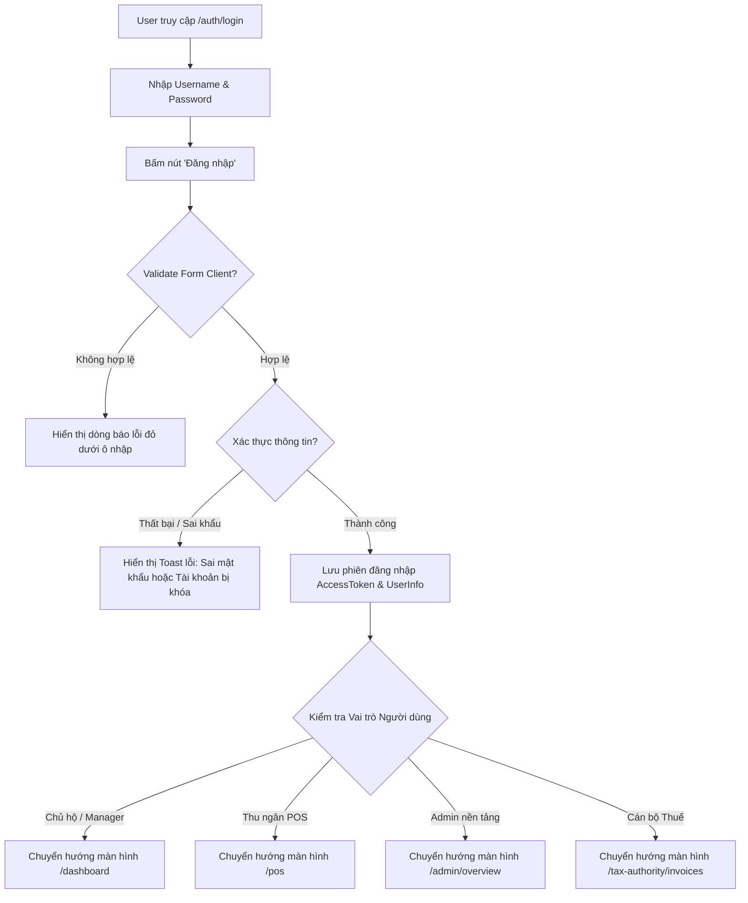
```mermaid
flowchart TD
    Start["User truy cập /auth/login"] --> InputForm["Nhập Username & Password"]
    InputForm --> ClickLogin["Bấm nút 'Đăng nhập'"]
    ClickLogin --> ValidateInput{"Validate Form Client?"}
    ValidateInput -->|Không hợp lệ| ShowClientErr["Hiển thị dòng báo lỗi đỏ dưới ô nhập"]
    ValidateInput -->|Hợp lệ| CheckAuth{"Xác thực thông tin?"}
    CheckAuth -->|Thất bại / Sai khẩu| ShowToastErr["Hiển thị Toast lỗi: Sai mật khẩu hoặc Tài khoản bị khóa"]
    CheckAuth -->|Thành công| SaveSession["Lưu phiên đăng nhập AccessToken & UserInfo"]
    SaveSession --> CheckRole{"Kiểm tra Vai trò Người dùng"}
    CheckRole -->|Chủ hộ / Manager| GoDashboard["Chuyển hướng màn hình /dashboard"]
    CheckRole -->|Thu ngân POS| GoPOS["Chuyển hướng màn hình /pos"]
    CheckRole -->|Admin nền tảng| GoAdmin["Chuyển hướng màn hình /admin/overview"]
    CheckRole -->|Cán bộ Thuế| GoTax["Chuyển hướng màn hình /tax-authority/invoices"]
```

---

### 1.2 Màn hình Đăng Ký Hộ Kinh Doanh (`/auth/register`)
- **Route**: `/auth/register` | **Component**: [RegisterPage.tsx](file:///d:/Intern/Codegym/BanHangViet/frontend/src/modules/auth/pages/RegisterPage.tsx)
- **Vai trò**: Chủ hộ kinh doanh mới.
- **Mã Backlog**: `NCL-01-CN-001`, `QTN-01`

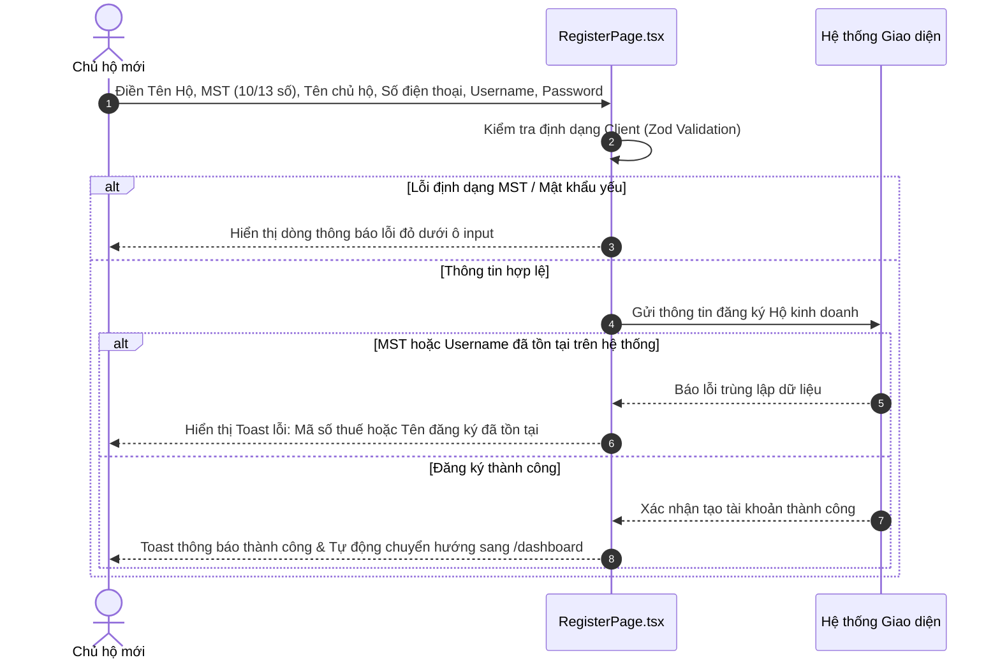
```mermaid
sequenceDiagram
    autonumber
    actor User as Chủ hộ mới
    participant UI as RegisterPage.tsx
    participant App as Hệ thống Giao diện

    User->>UI: Điền Tên Hộ, MST (10/13 số), Tên chủ hộ, Số điện thoại, Username, Password
    UI->>UI: Kiểm tra định dạng Client (Zod Validation)
    alt Lỗi định dạng MST / Mật khẩu yếu
        UI-->>User: Hiển thị dòng thông báo lỗi đỏ dưới ô input
    else Thông tin hợp lệ
        UI->>App: Gửi thông tin đăng ký Hộ kinh doanh
        alt MST hoặc Username đã tồn tại trên hệ thống
            App-->>UI: Báo lỗi trùng lập dữ liệu
            UI-->>User: Hiển thị Toast lỗi: Mã số thuế hoặc Tên đăng ký đã tồn tại
        else Đăng ký thành công
            App-->>UI: Xác nhận tạo tài khoản thành công
            UI-->>User: Toast thông báo thành công & Tự động chuyển hướng sang /dashboard
        end
    end
```

---

### 1.3 Màn hình Quản Lý Nhân Viên & Phân Quyền (`/employees`)
- **Route**: `/employees` | **Component**: [EmployeePage.tsx](file:///d:/Intern/Codegym/BanHangViet/frontend/src/modules/employee/pages/EmployeePage.tsx)
- **Vai trò**: Chủ hộ kinh doanh (`normal_management`).
- **Mã Backlog**: `NCL-01-CN-003`, `NCL-01-CN-004`

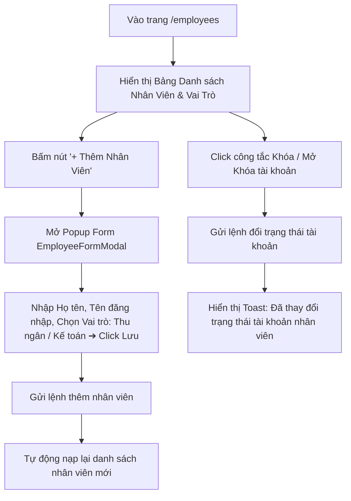
```mermaid
flowchart TD
    Start["Vào trang /employees"] --> RenderTable["Hiển thị Bảng Danh sách Nhân Viên & Vai Trò"]
    
    RenderTable --> ClickAdd["Bấm nút '+ Thêm Nhân Viên'"]
    ClickAdd --> OpenAddModal["Mở Popup Form EmployeeFormModal"]
    OpenAddModal --> SubmitAdd["Nhập Họ tên, Tên đăng nhập, Chọn Vai trò: Thu ngân / Kế toán ➔ Click Lưu"]
    SubmitAdd --> ProcessAdd["Gửi lệnh thêm nhân viên"]
    ProcessAdd --> RefreshAdd["Tự động nạp lại danh sách nhân viên mới"]

    RenderTable --> ClickStatus["Click công tắc Khóa / Mở Khóa tài khoản"]
    ClickStatus --> ProcessStatus["Gửi lệnh đổi trạng thái tài khoản"]
    ProcessStatus --> ToastStatus["Hiển thị Toast: Đã thay đổi trạng thái tài khoản nhân viên"]
```

---

### 1.4 Luồng Quản Lý Phiên Đăng Nhập & Hết Hạn Token (`/auth/*`)
- **Route**: Tất cả trang nội bộ | **Component**: [PrivateRoute.tsx](file:///d:/Intern/Codegym/BanHangViet/frontend/src/routers/guards/PrivateRoute.tsx)
- **Vai trò**: Tất cả người dùng đã đăng nhập.
- **Mã Backlog**: `NCL-01-CN-002`

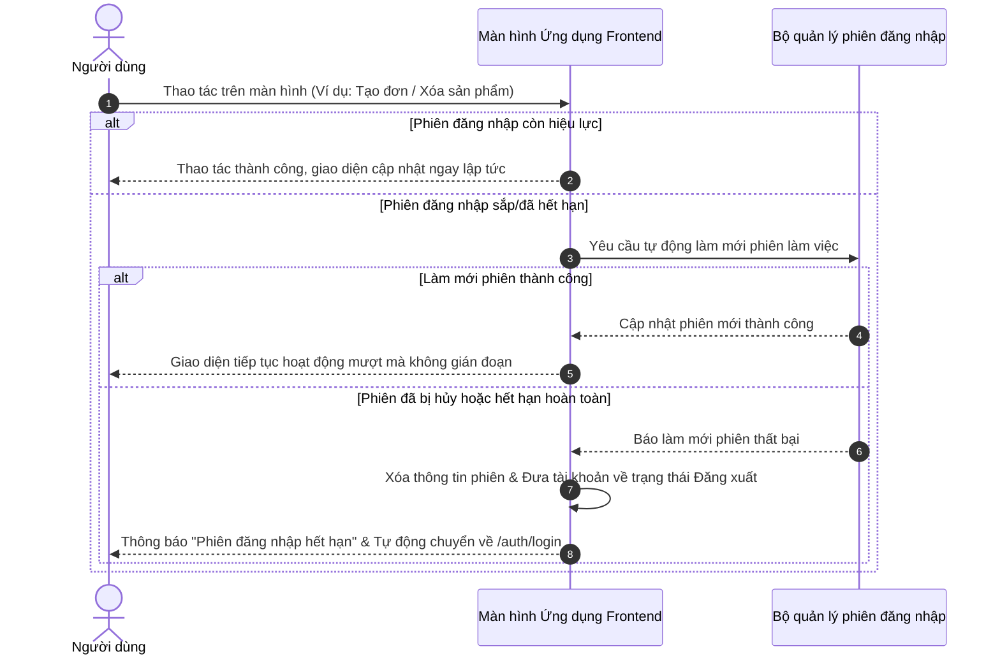
```mermaid
sequenceDiagram
    autonumber
    actor User as Người dùng
    participant UI as Màn hình Ứng dụng Frontend
    participant Session as Bộ quản lý phiên đăng nhập

    User->>UI: Thao tác trên màn hình (Ví dụ: Tạo đơn / Xóa sản phẩm)
    alt Phiên đăng nhập còn hiệu lực
        UI-->>User: Thao tác thành công, giao diện cập nhật ngay lập tức
    else Phiên đăng nhập sắp/đã hết hạn
        UI->>Session: Yêu cầu tự động làm mới phiên làm việc
        alt Làm mới phiên thành công
            Session-->>UI: Cập nhật phiên mới thành công
            UI-->>User: Giao diện tiếp tục hoạt động mượt mà không gián đoạn
        else Phiên đã bị hủy hoặc hết hạn hoàn toàn
            Session-->>UI: Báo làm mới phiên thất bại
            UI->>UI: Xóa thông tin phiên & Đưa tài khoản về trạng thái Đăng xuất
            UI-->>User: Thông báo "Phiên đăng nhập hết hạn" & Tự động chuyển về /auth/login
        end
    end
```

---

## 2. PHÂN HỆ 2: QUẢN LÝ HÀNG HÓA & TỒN KHO (NCL-02, NCL-09)

### 2.1 Màn hình Danh Mục Hàng Hóa & Nhập từ Excel (`/products`)
- **Route**: `/products` | **Component**: [ProductListPage.tsx](file:///d:/Intern/Codegym/BanHangViet/frontend/src/modules/product/pages/ProductListPage.tsx)
- **Mã Backlog**: `NCL-02-CN-001`, `NCL-02-CN-002`, `NCL-02-CN-004`, `NCL-09-CN-005`

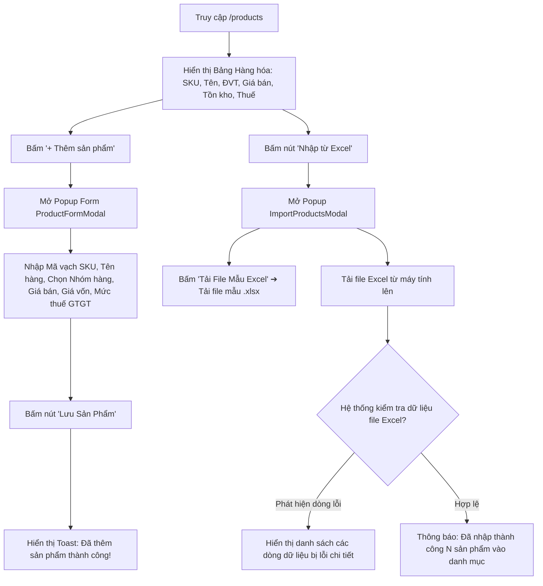
```mermaid
flowchart TD
    Start["Truy cập /products"] --> ShowGrid["Hiển thị Bảng Hàng hóa: SKU, Tên, ĐVT, Giá bán, Tồn kho, Thuế"]
    
    ShowGrid --> ActionAdd["Bấm '+ Thêm sản phẩm'"]
    ActionAdd --> OpenModal["Mở Popup Form ProductFormModal"]
    OpenModal --> FillData["Nhập Mã vạch SKU, Tên hàng, Chọn Nhóm hàng, Giá bán, Giá vốn, Mức thuế GTGT"]
    FillData --> SaveProd["Bấm nút 'Lưu Sản Phẩm'"]
    SaveProd --> ToastSuccess["Hiển thị Toast: Đã thêm sản phẩm thành công!"]

    ShowGrid --> ActionImport["Bấm nút 'Nhập từ Excel'"]
    ActionImport --> OpenImportModal["Mở Popup ImportProductsModal"]
    OpenImportModal --> DownloadTemplate["Bấm 'Tải File Mẫu Excel' ➔ Tải file mẫu .xlsx"]
    OpenImportModal --> UploadFile["Tải file Excel từ máy tính lên"]
    UploadFile --> ValidateExcel{"Hệ thống kiểm tra dữ liệu file Excel?"}
    ValidateExcel -->|Phát hiện dòng lỗi| ShowErrorList["Hiển thị danh sách các dòng dữ liệu bị lỗi chi tiết"]
    ValidateExcel -->|Hợp lệ| ImportSuccess["Thông báo: Đã nhập thành công N sản phẩm vào danh mục"]
```

---

### 2.2 Màn hình & Modal Quản Lý Nhóm Hàng (`/products`)
- **Route**: `/products` | **Component**: [ProductGroupManagerModal.tsx](file:///d:/Intern/Codegym/BanHangViet/frontend/src/modules/product/components/ProductGroupManagerModal.tsx)
- **Mã Backlog**: `NCL-02-CN-003`

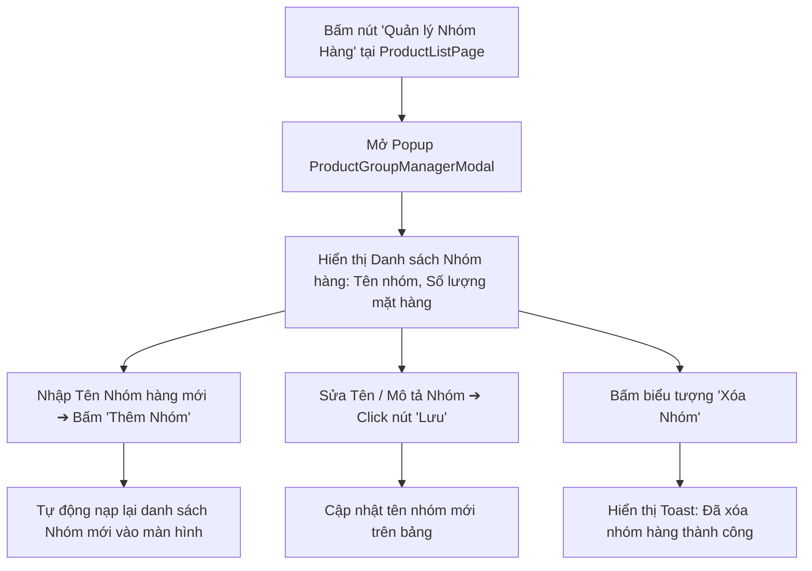
```mermaid
flowchart TD
    Start["Bấm nút 'Quản lý Nhóm Hàng' tại ProductListPage"] --> OpenGroupModal["Mở Popup ProductGroupManagerModal"]
    OpenGroupModal --> RenderGroupList["Hiển thị Danh sách Nhóm hàng: Tên nhóm, Số lượng mặt hàng"]
    
    RenderGroupList --> AddGroup["Nhập Tên Nhóm hàng mới ➔ Bấm 'Thêm Nhóm'"]
    AddGroup --> RefreshAdd["Tự động nạp lại danh sách Nhóm mới vào màn hình"]

    RenderGroupList --> EditGroup["Sửa Tên / Mô tả Nhóm ➔ Click nút 'Lưu'"]
    EditGroup --> UpdateUI["Cập nhật tên nhóm mới trên bảng"]

    RenderGroupList --> DeleteGroup["Bấm biểu tượng 'Xóa Nhóm'"]
    DeleteGroup --> ToastGroup["Hiển thị Toast: Đã xóa nhóm hàng thành công"]
```

---

### 2.3 Màn hình Phiếu Nhập Kho (`/products/stock-entry`)
- **Route**: `/products/stock-entry` | **Components**: [StockEntryPage.tsx](file:///d:/Intern/Codegym/BanHangViet/frontend/src/modules/product/pages/StockEntryPage.tsx), [GoodsReceiptModal.tsx](file:///d:/Intern/Codegym/BanHangViet/frontend/src/modules/product/components/GoodsReceiptModal.tsx)
- **Mã Backlog**: `NCL-02-CN-005`

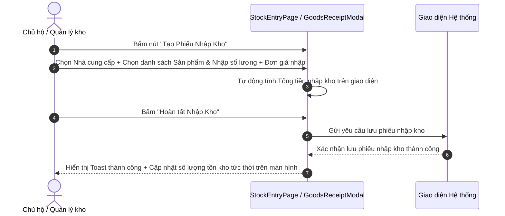
```mermaid
sequenceDiagram
    autonumber
    actor User as Chủ hộ / Quản lý kho
    participant UI as StockEntryPage / GoodsReceiptModal
    participant App as Giao diện Hệ thống

    User->>UI: Bấm nút "Tạo Phiếu Nhập Kho"
    User->>UI: Chọn Nhà cung cấp + Chọn danh sách Sản phẩm & Nhập số lượng + Đơn giá nhập
    UI->>UI: Tự động tính Tổng tiền nhập kho trên giao diện
    User->>UI: Bấm "Hoàn tất Nhập Kho"
    UI->>App: Gửi yêu cầu lưu phiếu nhập kho
    App-->>UI: Xác nhận lưu phiếu nhập kho thành công
    UI-->>User: Hiển thị Toast thành công + Cập nhật số lượng tồn kho tức thời trên màn hình
```

---

## 3. PHÂN HỆ 3: BÁN HÀNG POS, CA LÀM VIỆC & ĐỒNG BỘ OFFLINE (NCL-03, NCL-07, NCL-08)

### 3.1 Màn hình Bán Hàng Tại Quầy POS (`/pos`)
- **Route**: `/pos` | **Component**: [PosPage.tsx](file:///d:/Intern/Codegym/BanHangViet/frontend/src/modules/pos/pages/PosPage.tsx)
- **Vai trò**: Thu ngân (`point_of_sale`), Chủ hộ (`normal_management`).
- **Mã Backlog**: `NCL-03-CN-001`, `NCL-03-CN-002`, `NCL-03-CN-003`, `NCL-03-CN-004`, `NCL-03-CN-005`, `QTN-07`, `QTN-08`

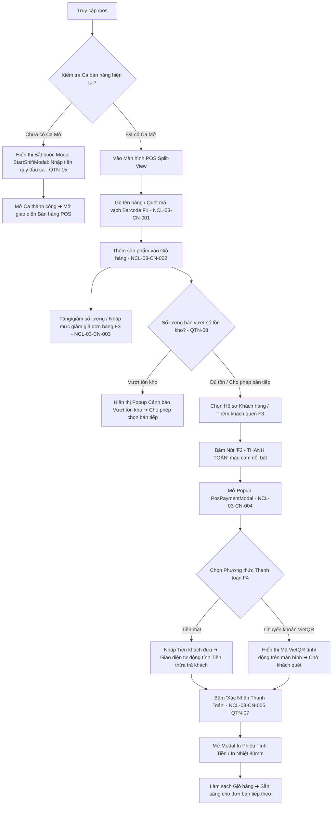
```mermaid
flowchart TD
    Start["Truy cập /pos"] --> CheckShift{"Kiểm tra Ca bán hàng hiện tại?"}
    CheckShift -->|Chưa có Ca Mở| ForceOpenShift["Hiển thị Bắt buộc Modal StartShiftModal: Nhập tiền quỹ đầu ca - QTN-15"]
    ForceOpenShift --> ShiftOpened["Mở Ca thành công ➔ Mở giao diện Bán hàng POS"]
    CheckShift -->|Đã có Ca Mở| IntoPOS["Vào Màn hình POS Split-View"]
    
    IntoPOS --> SearchProduct["Gõ tên hàng / Quét mã vạch Barcode F1 - NCL-03-CN-001"]
    SearchProduct --> AddToCart["Thêm sản phẩm vào Giỏ hàng - NCL-03-CN-002"]
    AddToCart --> EditQty["Tăng/giảm số lượng / Nhập mức giảm giá đơn hàng F3 - NCL-03-CN-003"]
    
    AddToCart --> CheckStock{"Số lượng bán vượt số tồn kho? - QTN-08"}
    CheckStock -->|Vượt tồn kho| ShowStockWarning["Hiển thị Popup Cảnh báo Vượt tồn kho ➔ Cho phép chọn bán tiếp"]
    CheckStock -->|Đủ tồn / Cho phép bán tiếp| SelectCustomer["Chọn Hồ sơ Khách hàng / Thêm khách quen F3"]
    
    SelectCustomer --> ClickPay["Bấm Nút 'F2 - THANH TOÁN' màu cam nổi bật"]
    
    ClickPay --> OpenPayModal["Mở Popup PosPaymentModal - NCL-03-CN-004"]
    OpenPayModal --> ChooseMethod{"Chọn Phương thức Thanh toán F4"}
    ChooseMethod -->|Tiền mặt| CashPay["Nhập Tiền khách đưa ➔ Giao diện tự động tính Tiền thừa trả khách"]
    ChooseMethod -->|Chuyển khoản VietQR| QRPay["Hiển thị Mã VietQR tĩnh/động trên màn hình ➔ Chờ khách quét"]
    
    CashPay --> ConfirmOrder[Bấm 'Xác Nhận Thanh Toán' - NCL-03-CN-005, QTN-07]
    QRPay --> ConfirmOrder[Bấm 'Xác Nhận Thanh Toán' - NCL-03-CN-005, QTN-07]
    ConfirmOrder --> PrintReceipt["Mở Modal In Phiếu Tính Tiền / In Nhiệt 80mm"]
    PrintReceipt --> ResetPos["Làm sạch Giỏ hàng ➔ Sẵn sàng cho đơn bán tiếp theo"]
```

---

### 3.2 Màn hình Mở/Đóng Ca & Lịch Sử Ca Làm Việc (`/shifts`)
- **Route**: `/shifts` | **Components**: [ShiftHistoryPage.tsx](file:///d:/Intern/Codegym/BanHangViet/frontend/src/modules/shift/pages/ShiftHistoryPage.tsx), [ShiftManagementPanel.tsx](file:///d:/Intern/Codegym/BanHangViet/frontend/src/modules/shift/components/ShiftManagementPanel.tsx), [ShiftHistoryTable.tsx](file:///d:/Intern/Codegym/BanHangViet/frontend/src/modules/shift/components/ShiftHistoryTable.tsx)
- **Mã Backlog**: `NCL-03-CN-006`, `NCL-03-CN-007`, `QTN-15`, `QTN-16`

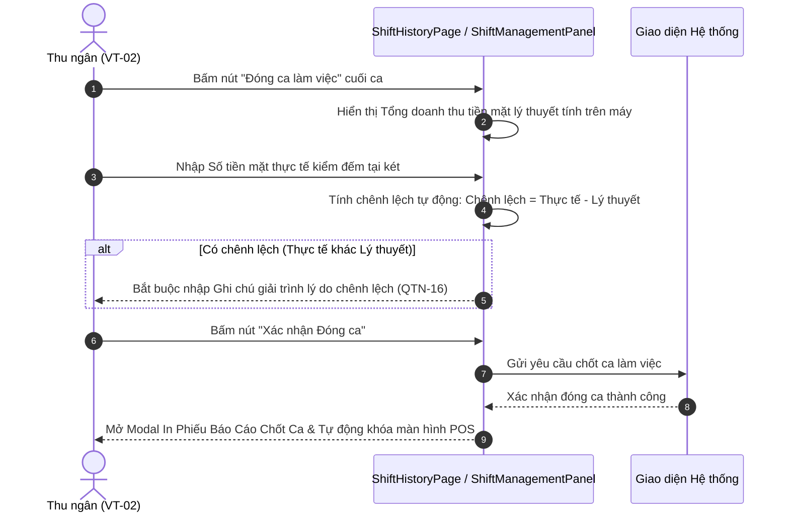
```mermaid
sequenceDiagram
    autonumber
    actor Cashier as Thu ngân (VT-02)
    participant UI as ShiftHistoryPage / ShiftManagementPanel
    participant App as Giao diện Hệ thống

    Cashier->>UI: Bấm nút "Đóng ca làm việc" cuối ca
    UI->>UI: Hiển thị Tổng doanh thu tiền mặt lý thuyết tính trên máy
    Cashier->>UI: Nhập Số tiền mặt thực tế kiểm đếm tại két
    UI->>UI: Tính chênh lệch tự động: Chênh lệch = Thực tế - Lý thuyết
    alt Có chênh lệch (Thực tế khác Lý thuyết)
        UI-->>Cashier: Bắt buộc nhập Ghi chú giải trình lý do chênh lệch (QTN-16)
    end
    Cashier->>UI: Bấm nút "Xác nhận Đóng ca"
    UI->>App: Gửi yêu cầu chốt ca làm việc
    App-->>UI: Xác nhận đóng ca thành công
    UI-->>Cashier: Mở Modal In Phiếu Báo Cáo Chốt Ca & Tự động khóa màn hình POS
```

---

### 3.3 Màn hình & Sơ đồ Bán Hàng Offline & Đồng Bộ Dữ Liệu (`/pos`, `/sync`)
- **Route**: `/pos` | **Components**: [PosPage.tsx](file:///d:/Intern/Codegym/BanHangViet/frontend/src/modules/pos/pages/PosPage.tsx), [ConflictResolutionModal.tsx](file:///d:/Intern/Codegym/BanHangViet/frontend/src/modules/sync/components/ConflictResolutionModal.tsx)
- **Vai trò**: Thu ngân (`point_of_sale`), Chủ hộ (`normal_management`).
- **Mã Backlog**: `NCL-08-CN-001`, `NCL-08-CN-002`, `NCL-08-CN-003`, `QTN-11`

#### 3.3.1 Luồng Bán Hàng Khi Mất Mạng (Offline POS Mode - NCL-08-CN-001)
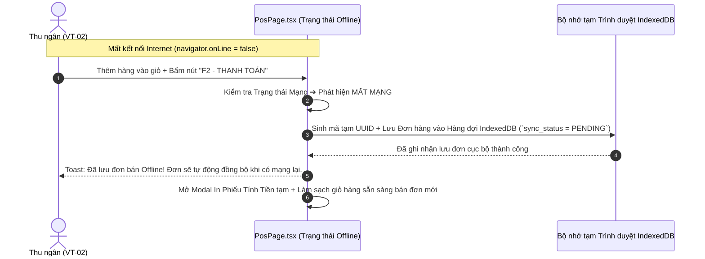
```mermaid
sequenceDiagram
    autonumber
    actor Cashier as Thu ngân (VT-02)
    participant UI as PosPage.tsx (Trạng thái Offline)
    participant IDB as Bộ nhớ tạm Trình duyệt IndexedDB
    
    Note over Cashier, UI: Mất kết nối Internet (navigator.onLine = false)
    Cashier->>UI: Thêm hàng vào giỏ + Bấm nút "F2 - THANH TOÁN"
    UI->>UI: Kiểm tra Trạng thái Mạng ➔ Phát hiện MẤT MẠNG
    UI->>IDB: Sinh mã tạm UUID + Lưu Đơn hàng vào Hàng đợi IndexedDB (`sync_status = PENDING`)
    IDB-->>UI: Đã ghi nhận lưu đơn cục bộ thành công
    UI-->>Cashier: Toast: Đã lưu đơn bán Offline! Đơn sẽ tự động đồng bộ khi có mạng lại.
    UI->>UI: Mở Modal In Phiếu Tính Tiền tạm + Làm sạch giỏ hàng sẵn sàng bán đơn mới
```

#### 3.3.2 Luồng Phục Hồi Kết Nối & Đồng Bộ Dữ Liệu (Data Sync & Conflict Resolution - NCL-08-CN-002, NCL-08-CN-003)
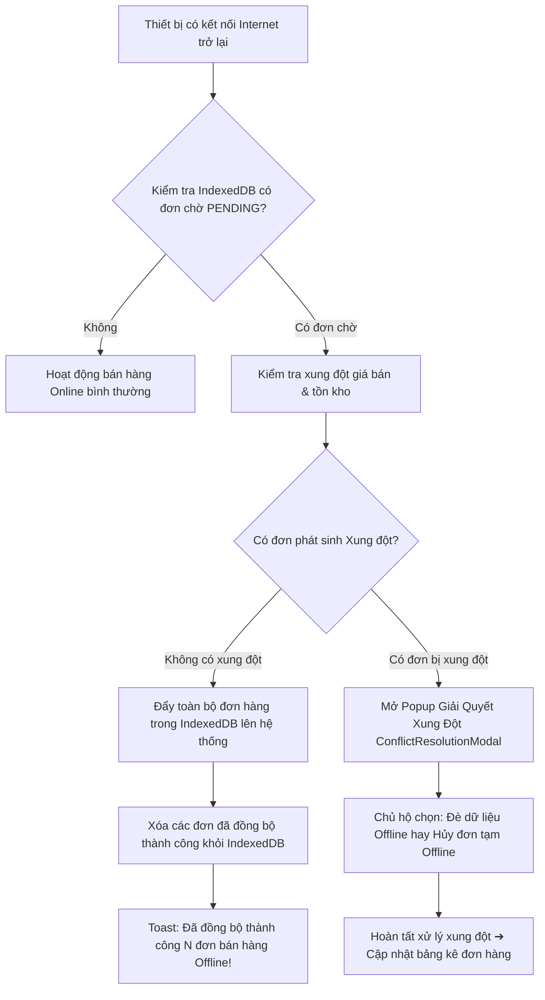
```mermaid
flowchart TD
    Start["Thiết bị có kết nối Internet trở lại"] --> CheckPending{"Kiểm tra IndexedDB có đơn chờ PENDING?"}
    CheckPending -->|Không| NormalOnline["Hoạt động bán hàng Online bình thường"]
    CheckPending -->|Có đơn chờ| CallCheck["Kiểm tra xung đột giá bán & tồn kho"]
    
    CallCheck --> ConflictCheck{"Có đơn phát sinh Xung đột?"}
    ConflictCheck -->|Không có xung đột| BulkUpload["Đẩy toàn bộ đơn hàng trong IndexedDB lên hệ thống"]
    BulkUpload --> ClearIDB["Xóa các đơn đã đồng bộ thành công khỏi IndexedDB"]
    ClearIDB --> ToastSyncSuccess["Toast: Đã đồng bộ thành công N đơn bán hàng Offline!"]

    ConflictCheck -->|Có đơn bị xung đột| OpenConflictModal["Mở Popup Giải Quyết Xung Đột ConflictResolutionModal"]
    OpenConflictModal --> ChooseResolve["Chủ hộ chọn: Đè dữ liệu Offline hay Hủy đơn tạm Offline"]
    ChooseResolve --> RefreshSync["Hoàn tất xử lý xung đột ➔ Cập nhật bảng kê đơn hàng"]
```

---

### 3.4 Luồng Bán Hàng trên Máy Tính Bảng & Điện Thoại (`/pos`)
- **Route**: `/pos` | **Component**: [PosPage.tsx](file:///d:/Intern/Codegym/BanHangViet/frontend/src/modules/pos/pages/PosPage.tsx) (Mobile Responsive Touch View)
- **Vai trò**: Thu ngân di động (`point_of_sale`).
- **Mã Backlog**: `NCL-03-CN-008`

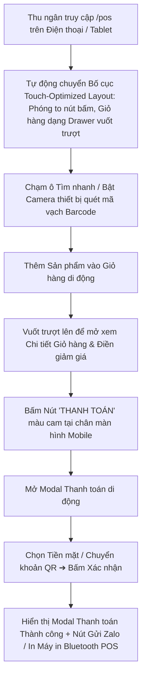
```mermaid
flowchart TD
    Start["Thu ngân truy cập /pos trên Điện thoại / Tablet"] --> AdaptLayout["Tự động chuyển Bố cục Touch-Optimized Layout: Phóng to nút bấm, Giỏ hàng dạng Drawer vuốt trượt"]
    
    AdaptLayout --> TouchSearch["Chạm ô Tìm nhanh / Bật Camera thiết bị quét mã vạch Barcode"]
    TouchSearch --> AddItem["Thêm Sản phẩm vào Giỏ hàng di động"]
    AddItem --> OpenCartDrawer["Vuốt trượt lên để mở xem Chi tiết Giỏ hàng & Điền giảm giá"]
    
    OpenCartDrawer --> ClickPayMobile["Bấm Nút 'THANH TOÁN' màu cam tại chân màn hình Mobile"]
    ClickPayMobile --> MobilePayModal["Mở Modal Thanh toán di động"]
    MobilePayModal --> ConfirmPay["Chọn Tiền mặt / Chuyển khoản QR ➔ Bấm Xác nhận"]
    ConfirmPay --> SuccessPrint["Hiển thị Modal Thanh toán Thành công + Nút Gửi Zalo / In Máy in Bluetooth POS"]
```

---

## 4. PHÂN HỆ 4: QUẢN LÝ ĐƠN HÀNG BÁN LẺ (NCL-03, NCL-04)

### 4.1 Màn hình Lịch Sử Đơn Hàng (`/orders`)
- **Route**: `/orders` | **Components**: [OrderHistoryPage.tsx](file:///d:/Intern/Codegym/BanHangViet/frontend/src/modules/order/pages/OrderHistoryPage.tsx), [OrderHistoryTable.tsx](file:///d:/Intern/Codegym/BanHangViet/frontend/src/modules/order/components/OrderHistoryTable.tsx)
- **Mã Backlog**: `NCL-03-CN-005`, `NCL-04-CN-001`, `QTN-03`

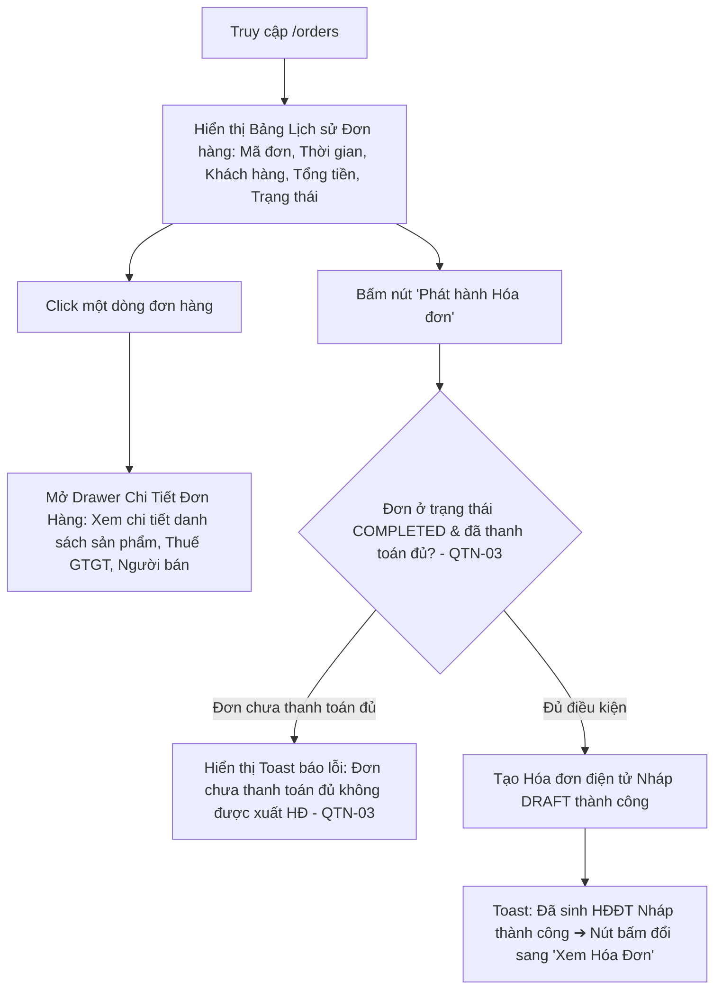
```mermaid
flowchart TD
    Start["Truy cập /orders"] --> RenderTable["Hiển thị Bảng Lịch sử Đơn hàng: Mã đơn, Thời gian, Khách hàng, Tổng tiền, Trạng thái"]
    
    RenderTable --> ViewDetail["Click một dòng đơn hàng"]
    ViewDetail --> OpenDrawer["Mở Drawer Chi Tiết Đơn Hàng: Xem chi tiết danh sách sản phẩm, Thuế GTGT, Người bán"]
    
    RenderTable --> ClickIssue["Bấm nút 'Phát hành Hóa đơn'"]
    ClickIssue --> CheckStatus{"Đơn ở trạng thái COMPLETED & đã thanh toán đủ? - QTN-03"}
    CheckStatus -->|Đơn chưa thanh toán đủ| BlockIssue["Hiển thị Toast báo lỗi: Đơn chưa thanh toán đủ không được xuất HĐ - QTN-03"]
    CheckStatus -->|Đủ điều kiện| CreateDraft["Tạo Hóa đơn điện tử Nháp DRAFT thành công"]
    CreateDraft --> ToastIssued["Toast: Đã sinh HĐĐT Nháp thành công ➔ Nút bấm đổi sang 'Xem Hóa Đơn'"]
```

---

## 5. PHÂN HỆ 5: HÓA ĐƠN ĐIỆN TỬ & THUẾ (NCL-04, NCL-05)

### 5.1 Màn hình Quản Lý Hóa Đơn Điện Tử (`/e-invoices`)
- **Route**: `/e-invoices` | **Components**: [InvoiceManagementPage.tsx](file:///d:/Intern/Codegym/BanHangViet/frontend/src/modules/e_invoice/pages/InvoiceManagementPage.tsx), [InvoiceDetailModal.tsx](file:///d:/Intern/Codegym/BanHangViet/frontend/src/modules/e_invoice/components/InvoiceDetailModal.tsx), [CancelInvoiceModal.tsx](file:///d:/Intern/Codegym/BanHangViet/frontend/src/modules/e_invoice/components/CancelInvoiceModal.tsx)
- **Mã Backlog**: `NCL-04-CN-002` đến `NCL-04-CN-005`, `NCL-05-CN-001`, `NCL-05-CN-003`, `NCL-05-CN-004`, `QTN-05`, `QTN-06`, `QTN-09`

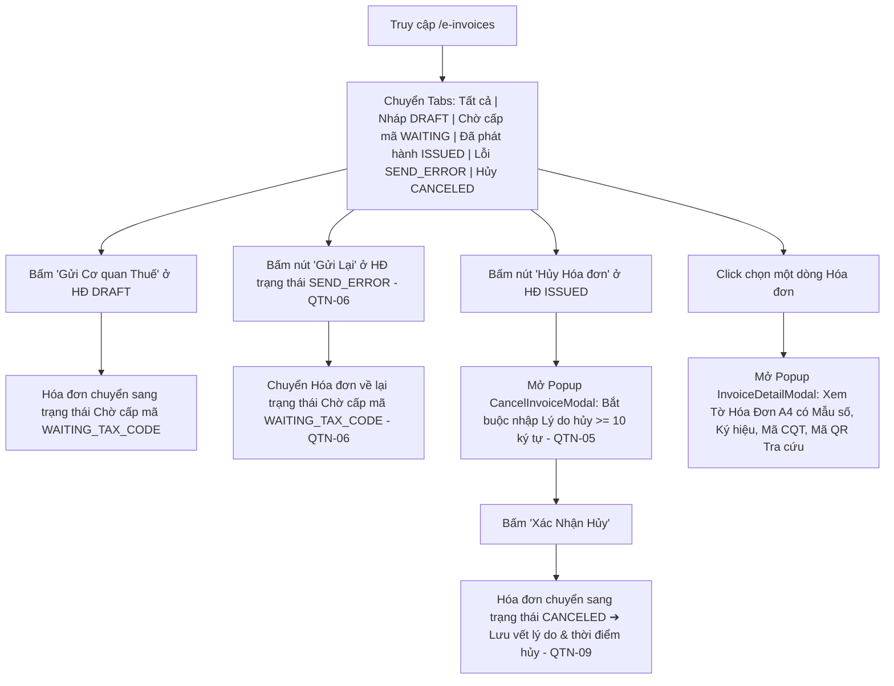
```mermaid
flowchart TD
    Start["Truy cập /e-invoices"] --> RenderTabs["Chuyển Tabs: Tất cả | Nháp DRAFT | Chờ cấp mã WAITING | Đã phát hành ISSUED | Lỗi SEND_ERROR | Hủy CANCELED"]
    
    RenderTabs --> ActionSendTax["Bấm 'Gửi Cơ quan Thuế' ở HĐ DRAFT"]
    ActionSendTax --> StatusWaiting["Hóa đơn chuyển sang trạng thái Chờ cấp mã WAITING_TAX_CODE"]

    RenderTabs --> ActionResend["Bấm nút 'Gửi Lại' ở HĐ trạng thái SEND_ERROR - QTN-06"]
    ActionResend --> StatusWaiting2["Chuyển Hóa đơn về lại trạng thái Chờ cấp mã WAITING_TAX_CODE - QTN-06"]

    RenderTabs --> ActionCancel["Bấm nút 'Hủy Hóa đơn' ở HĐ ISSUED"]
    ActionCancel --> OpenCancelDialog["Mở Popup CancelInvoiceModal: Bắt buộc nhập Lý do hủy >= 10 ký tự - QTN-05"]
    OpenCancelDialog --> SubmitCancel["Bấm 'Xác Nhận Hủy'"]
    SubmitCancel --> StatusCanceled["Hóa đơn chuyển sang trạng thái CANCELED ➔ Lưu vết lý do & thời điểm hủy - QTN-09"]

    RenderTabs --> ActionView["Click chọn một dòng Hóa đơn"]
    ActionView --> OpenInvoiceView["Mở Popup InvoiceDetailModal: Xem Tờ Hóa Đơn A4 có Mẫu số, Ký hiệu, Mã CQT, Mã QR Tra cứu"]
```

---

### 5.2 Màn hình Lập Hóa Đơn Điều Chỉnh (`/e-invoices/:id/adjust`)
- **Route**: `/e-invoices/:id/adjust` | **Component**: [AdjustInvoicePage.tsx](file:///d:/Intern/Codegym/BanHangViet/frontend/src/modules/e_invoice/pages/AdjustInvoicePage.tsx)
- **Mã Backlog**: `NCL-05-CN-002`, `QTN-04`, `QTN-12`

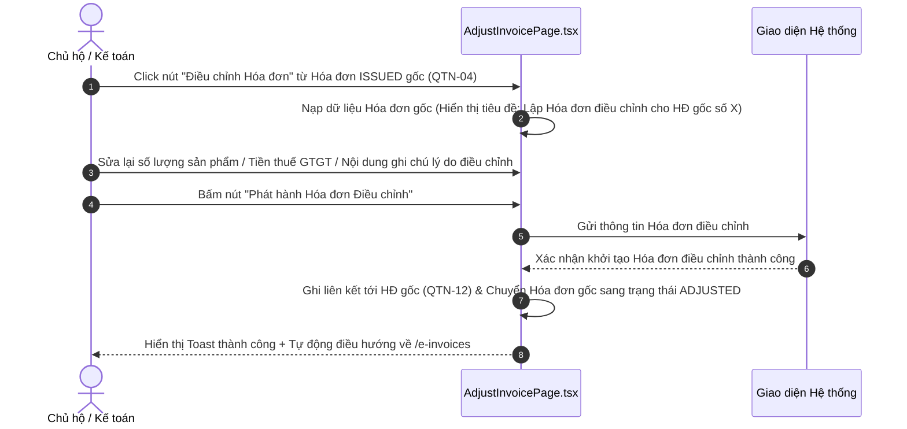
```mermaid
sequenceDiagram
    autonumber
    actor User as Chủ hộ / Kế toán
    participant UI as AdjustInvoicePage.tsx
    participant App as Giao diện Hệ thống

    User->>UI: Click nút "Điều chỉnh Hóa đơn" từ Hóa đơn ISSUED gốc (QTN-04)
    UI->>UI: Nạp dữ liệu Hóa đơn gốc (Hiển thị tiêu đề: Lập Hóa đơn điều chỉnh cho HĐ gốc số X)
    User->>UI: Sửa lại số lượng sản phẩm / Tiền thuế GTGT / Nội dung ghi chú lý do điều chỉnh
    User->>UI: Bấm nút "Phát hành Hóa đơn Điều chỉnh"
    UI->>App: Gửi thông tin Hóa đơn điều chỉnh
    App-->>UI: Xác nhận khởi tạo Hóa đơn điều chỉnh thành công
    UI->>UI: Ghi liên kết tới HĐ gốc (QTN-12) & Chuyển Hóa đơn gốc sang trạng thái ADJUSTED
    UI-->>User: Hiển thị Toast thành công + Tự động điều hướng về /e-invoices
```

---

## 6. PHÂN HỆ 6: KÊNH GỬI & TRA CỨU HÓA ĐƠN (NCL-06)

### 6.1 Popup Gửi Hóa Đơn Đa Kênh & Tra Cứu Công Khai (`/lookup-invoice`)
- **Route**: `/lookup-invoice` | **Components**: [LookupInvoicePage.tsx](file:///d:/Intern/Codegym/BanHangViet/frontend/src/pages/LookupInvoicePage.tsx), [SendInvoiceModal.tsx](file:///d:/Intern/Codegym/BanHangViet/frontend/src/modules/e_invoice/components/SendInvoiceModal.tsx)
- **Mã Backlog**: `NCL-06-CN-001` đến `NCL-06-CN-004`

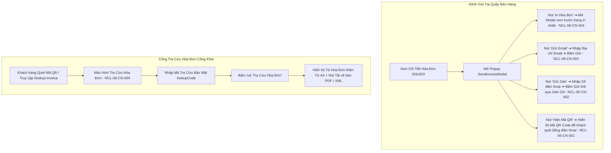
```mermaid
flowchart TD
    subgraph Kênh Gửi Tại Quầy Bán Hàng
        Action["Xem Chi Tiết Hóa Đơn ISSUED"] --> MultiChannel["Mở Popup SendInvoiceModal"]
        MultiChannel --> BtnPrint["Nút 'In Hóa đơn' ➔ Mở Modal xem trước trang in nhiệt - NCL-06-CN-003"]
        MultiChannel --> BtnEmail["Nút 'Gửi Email' ➔ Nhập Địa chỉ Email ➔ Bấm Gửi - NCL-06-CN-002"]
        MultiChannel --> BtnZalo["Nút 'Gửi Zalo' ➔ Nhập Số điện thoại ➔ Bấm Gửi link qua Zalo OA - NCL-06-CN-002"]
        MultiChannel --> BtnQR["Nút 'Hiện Mã QR' ➔ Hiển thị Mã QR Code để khách quét bằng điện thoại - NCL-06-CN-001"]
    end

    subgraph Cổng Tra Cứu Hóa Đơn Công Khai
        Customer["Khách hàng Quét Mã QR / Truy cập /lookup-invoice"] --> PublicPage["Màn hình Tra Cứu Hóa Đơn - NCL-06-CN-004"]
        PublicPage --> InputCode["Nhập Mã Tra Cứu Bảo Mật lookupCode"]
        InputCode --> SearchClick["Bấm nút 'Tra Cứu Hóa Đơn'"]
        SearchClick --> RenderPDF["Hiển thị Tờ Hóa Đơn Điện Tử A4 + Nút Tải về bản PDF / XML"]
    end
```

---

## 7. PHÂN HỆ 7: BÁO CÁO, NHẬT KÝ & DASHBOARD (NCL-07)

### 7.1 Màn hình Báo Cáo Doanh Thu Theo Ngày & Mặt Hàng (`/reports/revenue`)
- **Route**: `/reports/revenue` | **Component**: [RevenueReportPage.tsx](file:///d:/Intern/Codegym/BanHangViet/frontend/src/modules/report/pages/RevenueReportPage.tsx)
- **Mã Backlog**: `NCL-07-CN-001`, `NCL-07-CN-002`, `QTN-10`

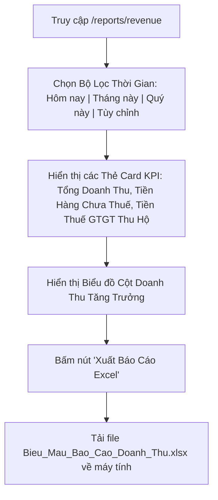
```mermaid
flowchart TD
    Start["Truy cập /reports/revenue"] --> SelectFilter["Chọn Bộ Lọc Thời Gian: Hôm nay | Tháng này | Quý này | Tùy chỉnh"]
    SelectFilter --> RenderKpi["Hiển thị các Thẻ Card KPI: Tổng Doanh Thu, Tiền Hàng Chưa Thuế, Tiền Thuế GTGT Thu Hộ"]
    RenderKpi --> RenderChart["Hiển thị Biểu đồ Cột Doanh Thu Tăng Trưởng"]
    
    RenderChart --> ClickExport["Bấm nút 'Xuất Báo Cáo Excel'"]
    ClickExport --> DownloadExcel["Tải file Bieu_Mau_Bao_Cao_Doanh_Thu.xlsx về máy tính"]
```

---

### 7.2 Màn hình Báo Cáo So Sánh Doanh Thu Giữa Các Kỳ (`/reports/comparison`)
- **Route**: `/reports/comparison` | **Component**: [RevenueComparisonPage.tsx](file:///d:/Intern/Codegym/BanHangViet/frontend/src/modules/report/pages/RevenueComparisonPage.tsx)
- **Mã Backlog**: `NCL-07-CN-006`

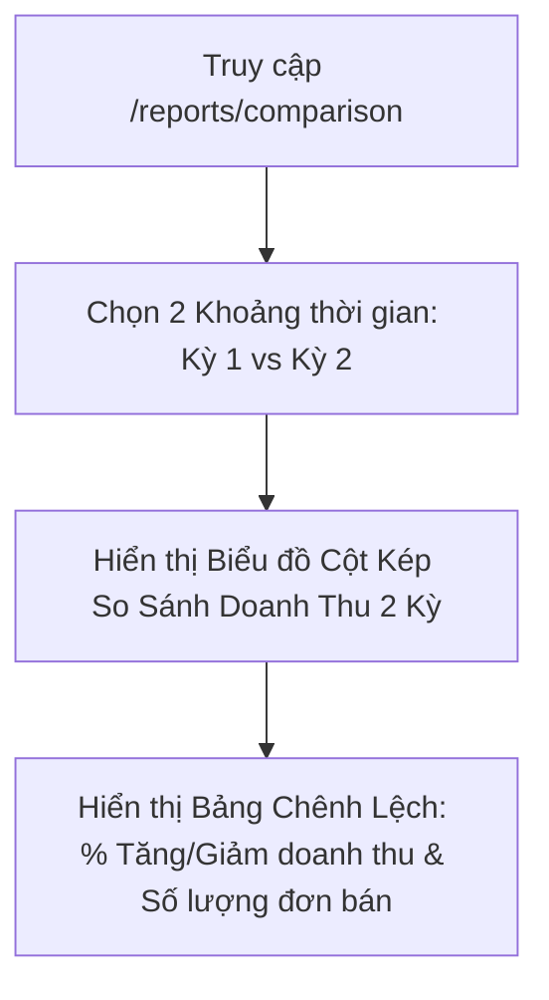
```mermaid
flowchart TD
    Start["Truy cập /reports/comparison"] --> SelectPeriods["Chọn 2 Khoảng thời gian: Kỳ 1 vs Kỳ 2"]
    SelectPeriods --> RenderComparisonChart["Hiển thị Biểu đồ Cột Kép So Sánh Doanh Thu 2 Kỳ"]
    RenderComparisonChart --> RenderDiffTable["Hiển thị Bảng Chênh Lệch: % Tăng/Giảm doanh thu & Số lượng đơn bán"]
```

---

### 7.3 Màn hình Báo Cáo Đối Chiếu Tiền & Doanh Thu Cuối Ngày (`/reports/reconciliation`)
- **Route**: `/reports/revenue` | **Component**: [RevenueReportPage.tsx](file:///d:/Intern/Codegym/BanHangViet/frontend/src/modules/report/pages/RevenueReportPage.tsx)
- **Mã Backlog**: `NCL-07-CN-003`, `QTN-16`

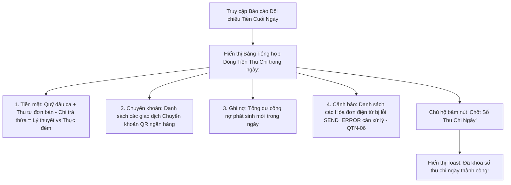
```mermaid
flowchart TD
    Start["Truy cập Báo cáo Đối chiếu Tiền Cuối Ngày"] --> RenderTables["Hiển thị Bảng Tổng hợp Dòng Tiền Thu Chi trong ngày:"]
    RenderTables --> CashTable["1. Tiền mặt: Quỹ đầu ca + Thu từ đơn bán - Chi trả thừa = Lý thuyết vs Thực đếm"]
    RenderTables --> QRTable["2. Chuyển khoản: Danh sách các giao dịch Chuyển khoản QR ngân hàng"]
    RenderTables --> DebtTable["3. Ghi nợ: Tổng dư công nợ phát sinh mới trong ngày"]
    RenderTables --> ErrorInvoiceTable["4. Cảnh báo: Danh sách các Hóa đơn điện tử bị lỗi SEND_ERROR cần xử lý - QTN-06"]
    
    RenderTables --> ClickLock["Chủ hộ bấm nút 'Chốt Sổ Thu Chi Ngày'"]
    ClickLock --> ToastReconcile["Hiển thị Toast: Đã khóa sổ thu chi ngày thành công!"]
```

---

### 7.4 Màn hình Thống Kê Mặt Hàng Bán Chạy (`/reports/top-selling`)
- **Route**: `/reports/revenue` | **Component**: [RevenueReportPage.tsx](file:///d:/Intern/Codegym/BanHangViet/frontend/src/modules/report/pages/RevenueReportPage.tsx)
- **Mã Backlog**: `NCL-07-CN-007`

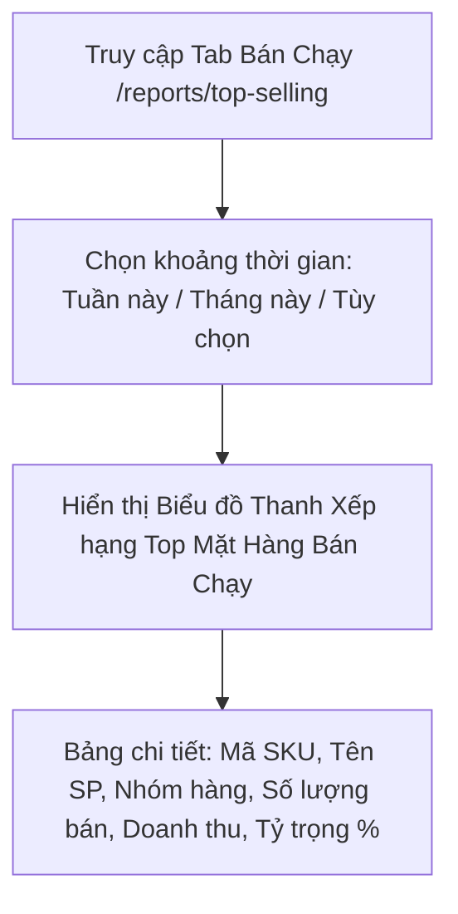
```mermaid
flowchart TD
    Start["Truy cập Tab Bán Chạy /reports/top-selling"] --> SelectDate["Chọn khoảng thời gian: Tuần này / Tháng này / Tùy chọn"]
    SelectDate --> RenderChart["Hiển thị Biểu đồ Thanh Xếp hạng Top Mặt Hàng Bán Chạy"]
    RenderChart --> RenderTable["Bảng chi tiết: Mã SKU, Tên SP, Nhóm hàng, Số lượng bán, Doanh thu, Tỷ trọng %"]
```

---

### 7.5 Màn hình Nhật Ký Hoạt Động (`/reports/activity-logs`)
- **Route**: `/reports/activity-logs` | **Component**: [ActivityLogPage.tsx](file:///d:/Intern/Codegym/BanHangViet/frontend/src/modules/report/pages/ActivityLogPage.tsx)
- **Mã Backlog**: `NCL-07-CN-004`, `QTN-09`

```mermaid
sequenceDiagram
    autonumber
    actor Admin as Chủ hộ / Manager
    participant UI as ActivityLogPage.tsx

    Admin->>UI: Truy cập /reports/activity-logs
    UI->>UI: Nạp danh sách nhật ký lịch sử thao tác hệ thống
    UI-->>Admin: Render Bảng Audit Log (Ví dụ: "Thu ngân A đã sửa giá sản phẩm B", "Chủ hộ X đã hủy hóa đơn Y")
```

---

### 7.6 Màn hình Bảng Điều Khiển Doanh Thu Tổng Quan Dashboard (`/dashboard`)
- **Route**: `/dashboard` | **Component**: [DashboardOverviewPage.tsx](file:///d:/Intern/Codegym/BanHangViet/frontend/src/modules/dashboard/pages/DashboardOverviewPage.tsx)
- **Vai trò**: Chủ hộ (`normal_management`), Kế toán (`normal_management`). Thu ngân (`point_of_sale`) xem ca cá nhân.
- **Mã Backlog**: `NCL-07-CN-005`, `QTN-10`

```mermaid
flowchart TD
    Start["Truy cập /dashboard"] --> CheckRole{"Kiểm tra Vai trò Người dùng - QTN-10"}
    CheckRole -->|Thu ngân point_of_sale| ShowCashierShift["Hiển thị Giao diện CashierShiftDashboard: Chỉ xem số liệu Ca & Đơn cá nhân"]
    CheckRole -->|Admin nền tảng platform_admin| RedirectAdmin["Tự động điều hướng sang /admin/overview"]
    CheckRole -->|Cơ quan Thuế tax_authority| RedirectTax["Tự động điều hướng sang /tax-authority/invoices"]
    
    CheckRole -->|Chủ hộ owner / Kế toán accountant| RenderDashboard["Render Màn hình Dashboard Tổng Quan Cửa Hàng"]
    RenderDashboard --> ShowKPIs["Các Thẻ KPI: Tổng Doanh Thu, Số Đơn hàng, Số Hóa đơn lỗi SEND_ERROR"]
    RenderDashboard --> ShowCharts["Biểu đồ Tăng trưởng Doanh Thu + Biểu đồ Tròn Phương thức Thanh toán"]
    RenderDashboard --> ShowTopSellers["Widget Top 5 Mặt hàng bán chạy nhất"]
    RenderDashboard --> ShowLogs["Panel Nhật ký Hoạt động thao tác gần nhất"]
```

---

## 8. PHÂN HỆ 8: QUẢN LÝ KHÁCH HÀNG & CÔNG NỢ (NCL-10)

### 8.1 Màn hình Quản Lý Khách Hàng (`/customers`)
- **Route**: `/customers` | **Components**: [CustomerPage.tsx](file:///d:/Intern/Codegym/BanHangViet/frontend/src/modules/customer/pages/CustomerPage.tsx), [CustomerManagement.tsx](file:///d:/Intern/Codegym/BanHangViet/frontend/src/modules/customer/components/CustomerManagement.tsx), [CustomerList.tsx](file:///d:/Intern/Codegym/BanHangViet/frontend/src/modules/customer/components/CustomerList.tsx), [CustomerFormModal.tsx](file:///d:/Intern/Codegym/BanHangViet/frontend/src/modules/customer/components/CustomerFormModal.tsx)
- **Mã Backlog**: `NCL-10-CN-001`

```mermaid
flowchart TD
    Start["Truy cập /customers"] --> RenderCustTable["Hiển thị Bảng Khách hàng: Họ tên, SĐT, Mã số thuế, Tích điểm, Tổng công nợ"]
    
    RenderCustTable --> AddCust["Bấm '+ Thêm Khách hàng'"]
    AddCust --> OpenModal["Mở Popup Form CustomerFormModal"]
    OpenModal --> SubmitCust["Điền Tên, SĐT, Địa chỉ, Hạn mức nợ ➔ Click Lưu ➔ Toast thành công"]

    RenderCustTable --> ViewHistory["Click một dòng Khách hàng"]
    ViewHistory --> OpenDrawer["Hiển thị Chi Tiết Khách Hàng: Lịch sử mua hàng & Điểm thưởng đã tích lũy"]
```

---

### 8.2 Màn hình Thu Nợ & Nhắc Nợ Khách Hàng (`/customers`, `/debts`)
- **Route**: `/customers` | **Components**: [CustomerPage.tsx](file:///d:/Intern/Codegym/BanHangViet/frontend/src/modules/customer/pages/CustomerPage.tsx), [DebtPaymentModal.tsx](file:///d:/Intern/Codegym/BanHangViet/frontend/src/modules/customer/components/DebtPaymentModal.tsx), [DebtReminderModal.tsx](file:///d:/Intern/Codegym/BanHangViet/frontend/src/modules/customer/components/DebtReminderModal.tsx)
- **Vai trò**: Chủ hộ (`normal_management`), Kế toán (`normal_management`).
- **Mã Backlog**: `NCL-10-CN-002`, `NCL-10-CN-003`, `QTN-13`, `QTN-14`

#### 8.2.1 Sơ Đồ Quy Trình Thu Nợ Khách Hàng (Customer Debt Collection - NCL-10-CN-002)
```mermaid
sequenceDiagram
    autonumber
    actor User as Chủ hộ / Kế toán
    participant UI as CustomerPage / DebtPaymentModal
    participant App as Giao diện Hệ thống

    User->>UI: Bấm nút "Thu nợ" tại dòng Khách hàng có dư nợ > 0
    UI->>UI: Hiển thị Tổng dư nợ hiện tại + Hạn mức nợ cho phép của Khách (QTN-13)
    User->>UI: Nhập Số tiền thu + Chọn Phương thức (Tiền mặt / Chuyển khoản) + Ghi chú
    User->>UI: Bấm nút "Xác Nhận Thu Nợ"
    UI->>App: Gửi thông tin thu nợ
    App-->>UI: Xác nhận ghi nhận thu nợ thành công
    UI-->>User: Toast thông báo: Đã ghi nhận thu nợ N VNĐ thành công + In phiếu thu nợ
```

#### 8.2.2 Sơ Đồ Nhắc Công Nợ & Cảnh Báo Đến Hạn (Debt Reminder Flow - NCL-10-CN-003, QTN-14)
```mermaid
flowchart TD
    Start["Click Mở Popup DebtReminderModal"] --> RenderDebtTable["Hiển thị Bảng Danh Sách Công Nợ: Khách hàng, Số nợ, Ngày nợ, Ngày đến hạn, Trạng thái OVERDUE - QTN-14"]
    
    RenderDebtTable --> ActionRemind["Bấm nút 'Gửi Email Nhắc Nợ'"]
    ActionRemind --> ConfirmRemind["Bấm 'Xác nhận Gửi'"]
    ConfirmRemind --> ToastRemindSuccess["Hiển thị Toast: Đã gửi email thông báo nhắc nợ tới Khách hàng thành công!"]
```

---

## 9. PHÂN HỆ 9: CẤU HÌNH CỬA HÀNG & DỮ LIỆU (NCL-09)

### 9.1 Màn hình Thông Tin Hộ Kinh Doanh (`/settings/business-info`)
- **Route**: `/settings/business-info` | **Component**: [BusinessInfoPage.tsx](file:///d:/Intern/Codegym/BanHangViet/frontend/src/modules/settings/pages/BusinessInfoPage.tsx)
- **Mã Backlog**: `NCL-09-CN-001`

```mermaid
flowchart TD
    Start["Truy cập /settings/business-info"] --> RenderForm["Hiển thị Form Thông tin: Tên hộ, Mã số thuế, Địa chỉ, SĐT, Tên Chủ hộ"]
    RenderForm --> EditForm["Chỉnh sửa thông tin cửa hàng ➔ Bấm nút 'Lưu Thay Đổi'"]
    EditForm --> ToastSave["Hiển thị Toast: Cập nhật thông tin hộ kinh doanh thành công!"]
```

---

### 9.2 Màn hình Cấu Hình Mẫu Hóa Đơn & Chữ Ký Số (`/settings/invoice-template`)
- **Route**: `/settings/invoice-template` | **Component**: [InvoiceTemplatePage.tsx](file:///d:/Intern/Codegym/BanHangViet/frontend/src/modules/settings/pages/InvoiceTemplatePage.tsx)
- **Mã Backlog**: `NCL-09-CN-002`, `QTN-02`

```mermaid
flowchart TD
    Start["Truy cập /settings/invoice-template"] --> ShowTemplate["Hiển thị Mẫu số, Ký hiệu HĐ 1C26TAA / C26TAA, Logo Hộ & Cấu hình Token Chữ ký số"]
    ShowTemplate --> UploadLogo["Tải Logo cửa hàng & Cấu hình Chữ ký số USB Token / HSM"]
    UploadLogo --> SaveTemplate["Bấm 'Lưu Cấu Hình Mẫu Hóa Đơn'"]
    SaveTemplate --> ToastTemplate["Hiển thị Toast: Đã lưu thiết lập Mẫu Hóa đơn hợp lệ - QTN-02"]
```

---

### 9.3 Màn hình Thuế Suất Đang Hiệu Lực (`/settings/tax-rates`)
- **Route**: `/settings/tax-rates` | **Component**: [TaxRateSettingsPage.tsx](file:///d:/Intern/Codegym/BanHangViet/frontend/src/modules/settings/pages/TaxRateSettingsPage.tsx)
- **Mã Backlog**: `NCL-09-CN-003`, `QTN-17`

```mermaid
flowchart TD
    Start["Truy cập /settings/tax-rates"] --> ShowTaxList["Danh sách Thuế suất: VAT0%, VAT5%, VAT8%, VAT10%"]
    ShowTaxList --> ToggleTax["Click Công tắc Bật/Tắt Trạng thái Hiệu lực của mức Thuế - QTN-17"]
    ToggleTax --> RefreshTax["Mức thuế được BẬT mới xuất hiện khi lập Hóa đơn"]
```

---

### 9.4 Màn hình Sao Lưu & Xuất Dữ Liệu Danh Mục (`/settings/backup-export`)
- **Route**: `/settings/backup-export` | **Component**: [BackupExportPage.tsx](file:///d:/Intern/Codegym/BanHangViet/frontend/src/modules/settings/pages/BackupExportPage.tsx)
- **Mã Backlog**: `NCL-09-CN-006`

```mermaid
flowchart TD
    Start["Truy cập /settings/backup-export"] --> ShowOptions["Tùy chọn: Sao lưu Hệ thống & Export Excel/JSON"]
    ShowOptions --> ClickBackup["Bấm nút 'Tạo Bản Sao Lưu Dữ Liệu'"]
    ClickBackup --> DownloadBackup["Tải file sao lưu SaoLuu_DuLieu_BanHangViet.json / .sql về máy"]
```

---

### 9.5 Màn hình Cấu Hình Máy In Hóa Đơn (`/settings/printer`)
- **Route**: `/settings/printer` | **Component**: [PrinterSettingsPage.tsx](file:///d:/Intern/Codegym/BanHangViet/frontend/src/modules/settings/pages/PrinterSettingsPage.tsx)
- **Mã Backlog**: `NCL-09-CN-004`

```mermaid
flowchart TD
    Start["Truy cập /settings/printer"] --> RenderPrinterForm["Form: Chọn Cổng kết nối LAN/IP / USB / Bluetooth + Khổ giấy 80mm / 58mm / A4"]
    RenderPrinterForm --> ClickTest["Bấm 'In Thử Nghiệm' ➔ Gửi lệnh in mẫu tới máy in đã chọn"]
    RenderPrinterForm --> ClickSavePrinter["Bấm 'Lưu Thiết Lập Máy In'"]
    ClickSavePrinter --> ToastPrinter["Hiển thị Toast: Cấu hình máy in hóa đơn đã được lưu!"]
```

---

## 10. PHÂN HỆ 10: WORKSPACE PLATFORM ADMIN (ADMIN NỀN TẢNG)

### 10.1 Màn hình Bảng Điều Khiển Tổng Quan Admin (`/admin/overview`)
- **Route**: `/admin/overview` | **Component**: [PlatformAdminOverviewPage.tsx](file:///d:/Intern/Codegym/BanHangViet/frontend/src/modules/platform_admin/pages/PlatformAdminOverviewPage.tsx)
- **Vai trò**: Quản trị viên hệ thống (`platform_admin`).

```mermaid
flowchart TD
    Start["Admin truy cập /admin/overview"] --> RenderMetrics["Metrics Cards: Tổng Hộ Kinh Doanh, Hộ đang hoạt động, Hộ sắp hết hạn, Tổng HĐĐT đã phát hành"]
    RenderMetrics --> RenderTrafficChart["Hiển thị Biểu đồ Lưu lượng Giao dịch & Request Hệ thống toàn nền tảng"]
```

---

### 10.2 Màn hình Quản Lý Hộ Kinh Doanh (`/admin/households`)
- **Route**: `/admin/households` | **Component**: [HouseholdManagementPage.tsx](file:///d:/Intern/Codegym/BanHangViet/frontend/src/modules/platform_admin/pages/HouseholdManagementPage.tsx)
- **Vai trò**: Quản trị viên hệ thống (`platform_admin`).

```mermaid
sequenceDiagram
    autonumber
    actor Admin as Platform Admin
    participant UI as HouseholdManagementPage.tsx

    Admin->>UI: Truy cập /admin/households
    UI-->>Admin: Render Danh sách Hộ kinh doanh & Gói dịch vụ đăng ký
    
    alt Khóa / Mở khóa Hộ Kinh Doanh
        Admin->>UI: Bấm công tắc Khóa/Mở khóa Hộ
        UI-->>Admin: Hiển thị Toast: Đã thay đổi trạng thái Hộ kinh doanh thành công
    else Gia hạn Gói Dịch vụ
        Admin->>UI: Click nút "Gia hạn" ➔ Chọn Ngày hết hạn mới
        UI-->>Admin: Hiển thị Toast: Gia hạn gói dịch vụ thành công!
    end
```

---

### 10.3 Màn hình Nhật Ký Hệ Thống Admin (`/admin/logs`)
- **Route**: `/admin/logs` | **Component**: [PlatformAdminLogsPage.tsx](file:///d:/Intern/Codegym/BanHangViet/frontend/src/modules/platform_admin/pages/PlatformAdminLogsPage.tsx)
- **Vai trò**: Quản trị viên hệ thống (`platform_admin`).

```mermaid
flowchart TD
    Start["Admin truy cập /admin/logs"] --> RenderLogTable["Bảng Nhật Ký Toàn Hệ Thống: Thời gian, Hộ KD, Người thực hiện, Tên Thao tác, Trạng thái, IP"]
    RenderLogTable --> FilterLogs["Lọc theo Cấp độ Error/Warning, Mã số thuế Hộ, Khoảng thời gian"]
```

---

## 11. PHÂN HỆ 11: WORKSPACE CƠ QUAN THUẾ MÔ PHỎNG (TAX AUTHORITY)

### 11.1 Cổng Duyệt Cấp Mã Hóa Đơn Điện Tử Cục Thuế (`/tax-authority/invoices`)
- **Route**: `/tax-authority/invoices` | **Component**: [TaxInvoiceApprovalRoutePage.tsx](file:///d:/Intern/Codegym/BanHangViet/frontend/src/modules/tax_authority/pages/TaxInvoiceApprovalRoutePage.tsx)
- **Vai trò**: Cán bộ Cục Thuế mô phỏng (`tax_authority`).
- **Mã Backlog**: `NCL-04-CN-003`, `NCL-04-CN-004`, `QTN-06`

```mermaid
sequenceDiagram
    autonumber
    actor TaxOfficer as Cán bộ Cục Thuế (VT-05)
    participant UI as TaxInvoiceApprovalRoutePage.tsx

    TaxOfficer->>UI: Truy cập /tax-authority/invoices
    UI-->>TaxOfficer: Render Danh sách Hóa đơn điện tử đang chờ cấp mã
    
    alt Hành động 1: Duyệt Cấp Mã
        TaxOfficer->>UI: Click nút "Duyệt cấp mã" ➔ Hệ thống sinh Mã CQT
        UI->>UI: Chuyển Trạng thái HĐ sang ISSUED + Gán Mã CQT & Số HĐ tăng dần
        UI-->>TaxOfficer: Hiển thị Toast: Đã cấp mã CQT thành công!
    else Hành động 2: Từ Chối Cấp Mã (Cảnh báo hạn QTN-06)
        TaxOfficer->>UI: Click "Từ chối" ➔ Nhập Thông báo lỗi (VD: Mã số thuế người mua không khớp)
        UI->>UI: Chuyển Trạng thái HĐ sang SEND_ERROR + Lưu Chi tiết Lỗi (QTN-06)
        UI-->>TaxOfficer: Hiển thị Toast: Đã chuyển trạng thái Lỗi gửi thuế
    end
```

---

## 📌 TỔNG KẾT BẢNG ÁNH XẠ MÀN HÌNH & BACKLOG (SUMMARY MATRIX)

| Phân Hệ | Số Lượng Màn Hình & Modals | Các Route Chính | Mã Backlog & Quy Tắc Ánh Xạ |
| :--- | :---: | :--- | :--- |
| **1. Xác Thực & Tài Khoản** | 3 Màn hình + 2 Modals | `/auth/login`, `/auth/register`, `/employees` | `NCL-01-CN-001` ➔ `004`, `QTN-01` |
| **2. Hàng Hóa & Tồn Kho** | 3 Màn hình + 5 Modals | `/products`, `/products/stock-entry` | `NCL-02-CN-001` ➔ `005`, `NCL-09-CN-005` |
| **3. POS, Ca & Đồng Bộ Offline** | 3 Màn hình + 6 Modals/Drawers | `/pos`, `/shifts`, `/sync` | `NCL-03-CN-001` ➔ `008`, `NCL-08-CN-001` ➔ `003`, `QTN-07,08,11,15,16` |
| **4. Đơn Hàng Bán Lẻ** | 1 Màn hình + 2 Drawers | `/orders` | `NCL-03-CN-005`, `NCL-04-CN-001`, `QTN-03` |
| **5. Hóa Đơn Điện Tử & Thuế**| 2 Màn hình + 4 Drawers/Modals| `/e-invoices`, `/e-invoices/:id/adjust` | `NCL-04-CN-002` ➔ `005`, `NCL-05-CN-001` ➔ `004`, `QTN-04,05,06,09,12` |
| **6. Kênh Gửi & Tra Cứu** | 1 Màn hình + 1 Popup | `/lookup-invoice` | `NCL-06-CN-001` ➔ `004` |
| **7. Báo Cáo, Nhật Ký & Dashboard** | 6 Màn hình | `/dashboard`, `/reports/*` | `NCL-07-CN-001` ➔ `007`, `QTN-09,10,16` |
| **8. Khách Hàng & Công Nợ** | 1 Màn hình + 3 Modals/Drawers | `/customers` | `NCL-10-CN-001` ➔ `003`, `QTN-13,14` |
| **9. Cấu Hình Cửa Hàng & Dữ Liệu** | 5 Màn hình | `/settings/*` | `NCL-09-CN-001` ➔ `006`, `QTN-02,17` |
| **10. Platform Admin** | 3 Màn hình | `/admin/*` | Nền tảng Admin hệ thống |
| **11. Cục Thuế Mô Phỏng** | 1 Màn hình + 1 Action Modal | `/tax-authority/invoices` | `NCL-04-CN-003`, `NCL-04-CN-004`, `QTN-06` |
