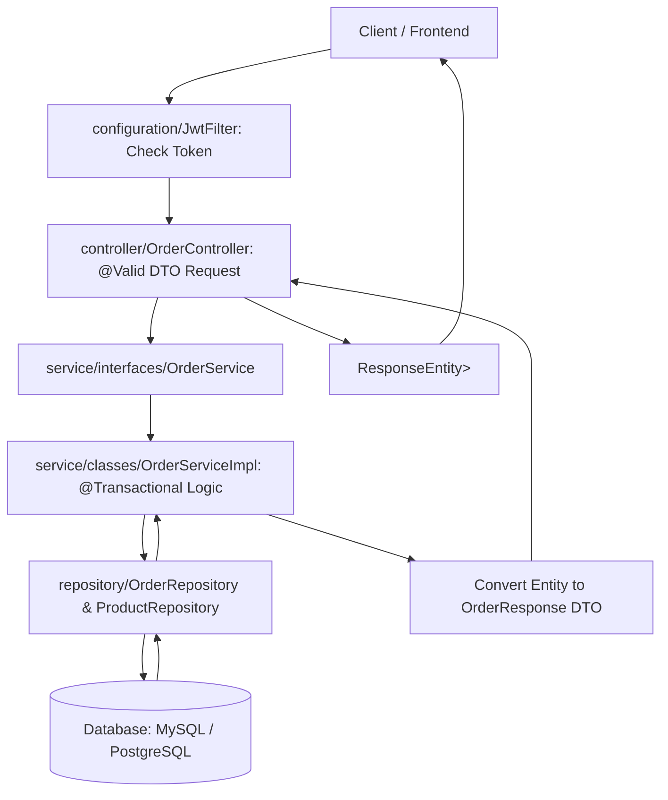
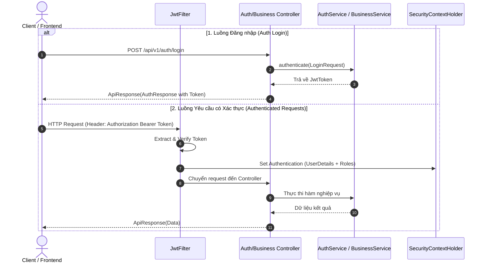
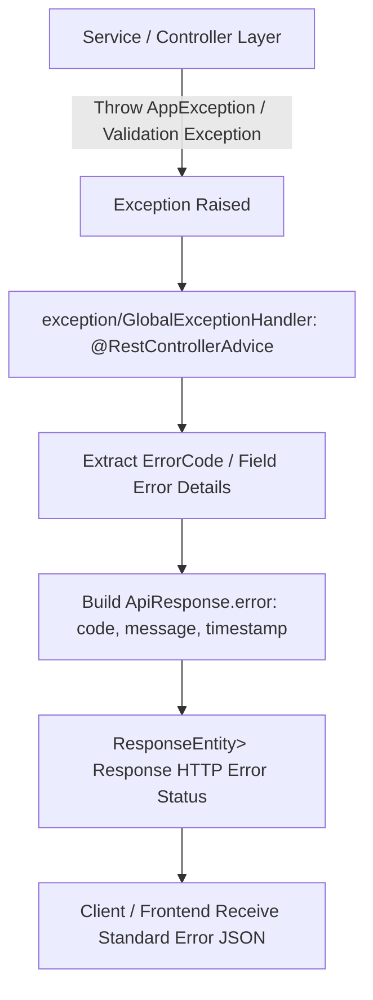

# Phân Tích Cấu Trúc Thư Mục & Luồng Hoạt Động Backend

Tài liệu này tổng hợp cấu trúc thư mục, chức năng của từng package, mối quan hệ giữa các tầng kiến trúc và sơ đồ luồng hoạt động của dự án Backend Spring Boot **Bán Hàng Việt**.

---

## 1. Cấu Trúc Tổng Quan Backend (`src/main/java/com/viet/sales/`)

Dự án Backend được thiết kế theo kiến trúc **Layered Architecture (Phân tầng chuẩn Spring Boot)** kết hợp với nguyên tắc **Decoupling (Tách rời giao diện và triển khai)** và **RESTful API Specification**.

```text
backend/src/main/java/com/viet/sales/
├── configuration/     # Cấu hình hệ thống (Spring Security, JWT Filter, CORS, Password Encoder)
├── constant/          # Các hằng số, Enum dùng chung (RoleCode, ShiftStatus...)
├── controller/        # Tầng REST Controllers (Tiếp nhận HTTP Requests, Validate & Trả về ApiResponse)
├── dto/               # Data Transfer Objects (Phân tách Request DTO & Response DTO)
│   ├── request/       # Đối tượng dữ liệu đầu vào gửi từ Client
│   └── response/      # Đối tượng dữ liệu phản hồi trả về cho Client
├── entity/            # Tầng JPA Entities (Ánh xạ các bảng trong CSDL Database)
├── exception/         # Xử lý lỗi tập trung (GlobalExceptionHandler, AppException, ErrorCode)
├── repository/        # Tầng Spring Data JPA Repositories (Truy vấn CSDL & Dynamic Query)
├── service/           # Tầng Xử lý Nghiệp vụ (Business Logic Layer)
│   ├── interfaces/    # Khai báo các Interface định nghĩa hàm nghiệp vụ
│   └── classes/       # Triển khai thực tế các Interface với chú thích @Service & @Transactional
├── specification/     # Xây dựng truy vấn động với JPA Criteria API (ProductSpecification...)
├── utils/             # Các hàm tiện ích bổ trợ
└── SalesApplication.java # Class chính chứa main() để khởi chạy ứng dụng Spring Boot
```

---

## 2. Chi Tiết Chức Năng Từng Package

### 🌐 1. `controller/` (Tầng REST Controllers - Tiếp nhận Yêu cầu)
- **Chức năng**: Là cổng tiếp nhận HTTP Request từ Client (`@RestController`), validate dữ liệu đầu vào sử dụng `@Valid`.
- **Quy tắc**: Chi tiết tại [controller/README.md](file:///d:/Intern/Codegym/BanHangViet/backend/src/main/java/com/viet/sales/controller/README.md). Tầng Controller **tuyệt đối không chứa logic nghiệp vụ** hay gọi trực tiếp Repository, mà chỉ gọi qua tầng Service và bọc dữ liệu trả về trong chuẩn đối tượng `ResponseEntity<ApiResponse<T>>`.

### 🧠 2. `service/` (Tầng Xử lý Nghiệp vụ - Heart of Application)
- **Chức năng**: Tập trung toàn bộ logic tính toán, kiểm tra điều kiện nghiệp vụ, điều phối dữ liệu giữa DTO, Entity và Repository.
- **Cấu trúc**: Chi tiết tại [service/README.md](file:///d:/Intern/Codegym/BanHangViet/backend/src/main/java/com/viet/sales/service/README.md).
  - **`interfaces/`**: Định nghĩa danh sách các hàm nghiệp vụ (ví dụ: `ProductService`, `OrderService`, `ShiftService`).
  - **`classes/`**: Lớp triển khai thực tế (ví dụ: `ProductServiceImpl`, `OrderServiceImpl`), sử dụng `@Service` và gắn `@Transactional` đối với các thao tác ghi/sửa dữ liệu phức tạp.

### 💾 3. `repository/` & `entity/` (Tầng Lưu trữ & Ánh xạ CSDL)
- **`entity/`**: Khai báo các lớp Java ánh xạ tương ứng với các bảng CSDL MySQL/PostgreSQL thông qua JPA Hibernate (`User`, `Product`, `Order`, `OrderItem`, `Shift`, `GoodsReceipt`...).
- **`repository/`**: Chứa các Interface mở rộng từ `JpaRepository<T, ID>` và `JpaSpecificationExecutor<T>`, cung cấp sẵn các phương thức CRUD và truy vấn tự tạo qua Spring Data JPA.

### 📦 4. `dto/` (Tầng Chuyển đổi Dữ liệu - Data Transfer Objects)
- **Chức năng**: Đóng vai trò làm lớp bọc dữ liệu, ngăn cách trực tiếp CSDL (`entity`) với tầng bên ngoài (`controller`).
  - `request/`: Chứa các Class đại diện cho dữ liệu client gửi lên (có kèm `@NotNull`, `@NotBlank`, `@Size`, `@Min` để validate).
  - `response/`: Chứa các Class cấu trúc dữ liệu trả về cho client.
  - `ApiResponse.java`: Đóng gói chuẩn chung cho mọi phản hồi API gồm: `code`, `message`, `result`, `timestamp`.

### 🔐 5. `configuration/` (Tầng Cấu hình System & Security)
- **[SecurityConfig.java](file:///d:/Intern/Codegym/BanHangViet/backend/src/main/java/com/viet/sales/configuration/SecurityConfig.java)**: Cấu hình Spring Security, phân quyền endpoint, vô hiệu hóa CSRF (cho REST API), cấu hình CORS và quản lý Session Stateless.
- **[JwtFilter.java](file:///d:/Intern/Codegym/BanHangViet/backend/src/main/java/com/viet/sales/configuration/JwtFilter.java)**: Middleware chặn mọi request, trích xuất và giải mã JWT token trong header `Authorization: Bearer <token>`, sau đó thiết lập context xác thực vào `SecurityContextHolder`.

### ⚠️ 6. `exception/` (Tầng Xử lý Lỗi Tập Trung)
- **[GlobalExceptionHandler.java](file:///d:/Intern/Codegym/BanHangViet/backend/src/main/java/com/viet/sales/exception/GlobalExceptionHandler.java)**: Được đánh dấu `@RestControllerAdvice`, bắt tất cả các ngoại lệ (`AppException`, `MethodArgumentNotValidException`, `AccessDeniedException`...) phát sinh từ bất kỳ đâu trong ứng dụng và quy đổi thành đối tượng `ApiResponse` chứa `ErrorCode` chuẩn xác.

### 🔍 7. `specification/` (Tầng Truy vấn Động)
- **Chức năng**: Sử dụng JPA Criteria API để xây dựng các bộ lọc tìm kiếm linh hoạt (search theo tên, khoảng giá, danh mục, trạng thái...) mà không cần viết các câu lệnh SQL tĩnh phức tạp.

---

## 3. Mối Quan Hệ & Phụ Thuộc Giữa Các Tầng Kiến Trúc

Mối quan hệ phụ thuộc giữa các tầng tuân thủ nguyên tắc **Clean Layered Architecture (Phụ thuộc một chiều từ Controller vào trong)**:

```text
[Client / Frontend Request]
       │
       ▼
[configuration/JwtFilter & SecurityConfig] (Tầng Bảo mật & Xác thực Token)
       │
       ▼
[controller/] (Tầng Tiếp nhận Request & Validate DTO)
       │ (gọi Service Interface)
       ▼
[service/interfaces & classes] (Tầng Xử lý Logic Nghiệp vụ)
       │                        ▲
       │ (gọi Repository)        │ (Sử dụng Specification / DTO / Constants)
       ▼                        │
[repository/] & [specification/] 
       │
       ▼
[entity/] ◄──────► [Database / CSDL]
```

---

## 4. Sơ Đồ Luồng Hoạt Động (Flow Diagrams)

### 🚀 Luồng 1: Xử lý Request Nghiệp vụ theo Chuẩn Layered Flow

**Mô tả văn bản:**
1. **Client** gửi HTTP Request (ví dụ `POST /api/v1/orders` kèm Body JSON) ➔ Request đi qua `JwtFilter` để kiểm tra Token.
2. `OrderController` tiếp nhận request, `@Valid` kiểm tra dữ liệu `CreateOrderRequest DTO`.
3. `OrderController` chuyển giao dữ liệu sang `OrderService` (Interface) / `OrderServiceImpl` (Implementation).
4. `OrderServiceImpl` thực thi logic nghiệp vụ (tính tổng tiền, trừ số lượng tồn kho, tạo mã đơn hàng, lưu hóa đơn).
5. `OrderServiceImpl` gọi `ProductRepository` và `OrderRepository` để tương tác với Database.
6. Kết quả từ Database được chuyển đổi thành `OrderResponse DTO`, đóng gói vào đối tượng `ApiResponse.success(...)` và trả về cho Client.



---

### 🔐 Luồng 2: Xác Thực & Phân Quyền JWT (Authentication & Authorization Flow)

**Mô tả văn bản:**
1. **Đăng nhập (`POST /api/v1/auth/login`)**:
   - `AuthController` tiếp nhận request ➔ `AuthServiceImpl` kiểm tra username & password với `BCryptPasswordEncoder`.
   - Nếu đúng ➔ `JwtService` tạo ra JWT Bearer Token chứa username & roles, trả về `AuthResponse`.
2. **Các Request tiếp theo**:
   - Client gửi Header `Authorization: Bearer <token>`.
   - `JwtFilter` chặn request, lấy Token, gọi `JwtService.extractUsername(token)`.
   - `UserDetailsService` nạp thông tin User & danh sách quyền (`GrantedAuthorities`).
   - Thiết lập thông tin vào `SecurityContextHolder.getContext().setAuthentication(authToken)`.
   - Request hợp lệ tiếp tục được chuyển đến Controller.



---

### ⚠️ Luồng 3: Xử lý Lỗi Tập Trung (Global Exception Handling Flow)

**Mô tả văn bản:**
1. Khi phát sinh lỗi tại tầng Service (ví dụ: không tìm thấy sản phẩm, tài khoản bị khóa, hoặc không đủ tồn kho), Service ném ra ngoại lệ `AppException(ErrorCode.PRODUCT_NOT_FOUND)`.
2. Nếu dữ liệu đầu vào gửi lên không hợp lệ, Spring Security / `@Valid` ném ra `MethodArgumentNotValidException`.
3. **`GlobalExceptionHandler`** (`@RestControllerAdvice`) tự động chặn lại ngoại lệ này.
4. Handler đọc thông tin từ `ErrorCode` hoặc danh sách lỗi validation, trích xuất HTTP Status và Error Message tương ứng.
5. Trả về cho Client phản hồi đồng nhất theo chuẩn `ApiResponse` với mã lỗi rõ ràng.



---

## 🛠️ Đánh Giá Tổng Kết Kiến Trúc Backend

1. **Chuẩn hóa Phản hồi & Xử lý Lỗi**: Tất cả API đều trả về dạng đồng nhất `ApiResponse<T>`, các lỗi đều được quy hoạch tập trung qua `ErrorCode` và `GlobalExceptionHandler`.
2. **Tính Decoupling & Dễ Bảo Trì**: Phân tách rõ ràng giữa Interface và Class cài đặt (`service/interfaces` vs `service/classes`), giữa Entity CSDL và DTO Request/Response giúp hệ thống an toàn, không lộ thông tin nhạy cảm của CSDL ra bên ngoài.
3. **Bảo mật Vững chắc**: Tích hợp Spring Security Stateless + JWT Filter xử lý mượt mà việc phân quyền theo từng vai trò (`RoleCode`).
