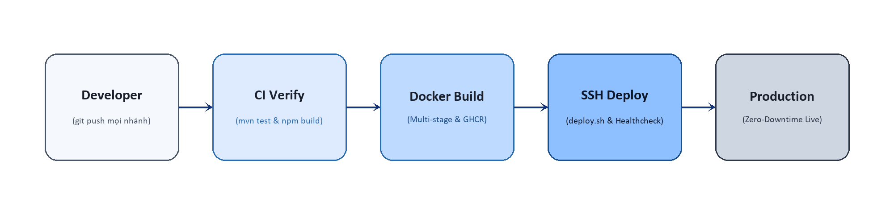
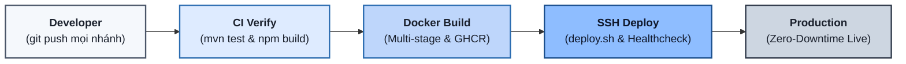

# Quy Trình CI/CD Tự Động Hóa - Bán Hàng Việt Monorepo

> **Tài liệu kỹ thuật trình bày & đối chiếu quy trình tự động hóa**  
> **Nguyên tắc**: 100% minh bạch - Có lệnh cụ thể - Sơ đồ khối luồng quyết định - Không văn xuôi thừa.

---

## 1. Sơ Đồ Khối Tuyến Tính 5 Bước (Linear 5-Block Diagram)

Sơ đồ khối ngang chuẩn hóa theo kiến trúc phân tầng, thể hiện 5 mắt xích cốt lõi từ lúc phát triển đến khi lên môi trường Production:





```text
+-----------------------+     +-----------------------+     +-----------------------+     +-----------------------+     +-----------------------+
|       Developer       |     |       CI Verify       |     |     Docker Build      |     |      SSH Deploy       |     |      Production       |
|                       | --> |                       | --> |                       | --> |                       | --> |                       |
|  (git push mọi nhánh) |     | (mvn test & npm build)|     |  (Multi-stage & GHCR) |     | (deploy.sh & Health)  |     |  (Zero-Downtime Live) |
+-----------------------+     +-----------------------+     +-----------------------+     +-----------------------+     +-----------------------+
```

---

## 2. Sơ Đồ Khối Luồng Quyết Định Rẽ Nhánh (Decision Flowchart)

### 🔹 2.1. Sơ Đồ Khối Trực Quan (Mermaid Flowchart)

```mermaid
flowchart TD
    START(["💻 Developer Push / PR"]):::startNode --> CHECK_BRANCH{"Loại nhánh?"}:::decisionNode

    %% GIAI ĐOẠN 1
    subgraph STAGE1 ["GIAI ĐOẠN 1: VERIFY SONG SONG (100% Mọi Nhánh)"]
        CHECK_BRANCH -->|"Bất kỳ nhánh nào\nbranches: ['**']"| RUN_TEST_BE["🧪 Verify Backend\n<code>cd backend && mvn test -B</code>"]:::jobNode
        CHECK_BRANCH -->|"Bất kỳ nhánh nào\nbranches: ['**']"| RUN_TEST_FE["🎨 Verify Frontend\n<code>cd frontend && npm ci && npm run lint && npm run build</code>"]:::jobNode
    end

    RUN_TEST_BE --> CHECK_TEST{"Cả 2 Job đều PASS?"}:::decisionNode
    RUN_TEST_FE --> CHECK_TEST

    CHECK_TEST -->|"❌ Có lỗi (Test Fail / Build Fail)"| STOP_FAIL["⛔ DỪNG PIPELINE\n• Báo đỏ GitHub PR\n• Chặn merge\n• KHÔNG build image\n• KHÔNG đụng đến VPS"]:::failNode

    CHECK_TEST -->|"✅ PASS 100%"| CHECK_PROD{"Nhánh hiện tại là\nproduction?"}:::decisionNode

    CHECK_PROD -->|"❌ Nhánh khác\n(feature, bugfix, dev...)"| END_TEST_ONLY["🏁 KẾT THÚC KIỂM THỬ\nCode đạt chuẩn, sẵn sàng Review/Merge"]:::passNode

    %% GIAI ĐOẠN 2
    subgraph STAGE2 ["GIAI ĐOẠN 2: BUILD & PUSH DOCKER (Chỉ Nhánh production)"]
        CHECK_PROD -->|"✅ Đúng nhánh production"| LOCK_QUEUE["🔒 Khóa Concurrency\n<code>group: production-deploy</code>"]:::jobNode
        LOCK_QUEUE --> DOCKER_LOGIN["🔑 Login GHCR\n<code>docker login ghcr.io</code>"]:::jobNode
        DOCKER_LOGIN --> DOCKER_BUILD["📦 Docker Buildx + Cache GHA\n• Tag: <code>ghcr.io/lean1835/banhangviet-be:&lt;sha&gt;</code> & <code>:latest</code>\n• Tag: <code>ghcr.io/lean1835/banhangviet-fe:&lt;sha&gt;</code> & <code>:latest</code>"]:::jobNode
        DOCKER_BUILD --> DOCKER_PUSH["🚀 Push Image lên GHCR"]:::jobNode
    end

    %% GIAI ĐOẠN 3
    subgraph STAGE3 ["GIAI ĐOẠN 3: DEPLOY PRODUCTION VPS (Rolling Zero-Downtime)"]
        DOCKER_PUSH --> SSH_CONNECT["🔑 SSH Agent kết nối VPS\n<code>PRODUCTION_SSH_KEY</code> & <code>PRODUCTION_IP</code>"]:::jobNode
        SSH_CONNECT --> SYNC_FILES["📂 Đồng bộ tệp hạ tầng & Secret\n• scp <code>docker-compose.yml</code> & <code>scripts/*.sh</code>\n• Ghi secret <code>ENV_PRODUCTION</code> vào <code>backend/.env</code>"]:::jobNode
        SYNC_FILES --> RUN_DEPLOY_SH["▶️ Chạy từ xa: <code>/bin/sh scripts/deploy.sh</code>"]:::jobNode

        subgraph VPS_FLOW ["Kịch Bản scripts/deploy.sh Trên Máy Chủ VPS"]
            RUN_DEPLOY_SH --> PULL_IMG["📥 Pull Images mới (Retry x3)"]:::vpsNode
            PULL_IMG --> NET_ATTACH["🌐 Gắn container CSDL <code>banhangviet-db</code> vào mạng <code>default_network</code>"]:::vpsNode
            NET_ATTACH --> UP_BE["🔄 Re-deploy Backend trước\n<code>docker compose up -d banhangviet-be</code>"]:::vpsNode
            UP_BE --> POLL_HEALTH{"Thăm dò Healthcheck\n<code>curl /api/v1/sync/health</code>\n(Tối đa 48 lần x 5s = 240s)"}:::decisionNode

            POLL_HEALTH -->|"❌ Sau 4 phút vẫn Unhealthy"| DEPLOY_ABORT["💥 BÁO LỖI DEPLOY & EXIT 1\n• In log 100 dòng Backend\n• Frontend cũ vẫn giữ nguyên chạy tiếp"]:::failNode
            POLL_HEALTH -->|"✅ Status: healthy"| UP_FE["🔄 Re-deploy Frontend sau\n<code>docker compose up -d banhangviet-fe</code>"]:::vpsNode
            UP_FE --> PRUNE["🧹 Dọn dẹp image rác: <code>docker image prune -f</code>"]:::vpsNode
        end
    end

    PRUNE --> DEPLOY_SUCCESS(["🎉 DEPLOY HOÀN TẤT - ZERO DOWNTIME"]):::passNode

    classDef startNode fill:#E8F8F5,stroke:#1ABC9C,stroke-width:2px,color:#0E6251;
    classDef decisionNode fill:#FEF9E7,stroke:#F39C12,stroke-width:2px,color:#7D6608;
    classDef jobNode fill:#EBF5FB,stroke:#3498DB,stroke-width:2px,color:#1B4F72;
    classDef vpsNode fill:#F4ECF7,stroke:#8E44AD,stroke-width:2px,color:#512E5F;
    classDef failNode fill:#FDEDEC,stroke:#E74C3C,stroke-width:2px,color:#78281F;
    classDef passNode fill:#EAFAF1,stroke:#2ECC71,stroke-width:2px,color:#145A32;
```



---

### 🔹 1.2. Sơ Đồ Khối Chữ Chuẩn (ASCII Block Diagram)

```text
+-------------------------------------------------------------------------------------------------------+
|                                        [ BẮT ĐẦU: git push / pull_request ]                           |
+-------------------------------------------------------------------------------------------------------+
                                                   |
                                                   v
+-------------------------------------------------------------------------------------------------------+
| GIAI ĐOẠN 1: VERIFY SONG SONG (Chạy trên 100% mọi nhánh)                                              |
|                                                                                                       |
|    +------------------------------------------+        +------------------------------------------+   |
|    | Job: verify-backend                      |        | Job: verify-frontend                     |   |
|    | [Lệnh]: cd backend && mvn test -B        |   &&   | [Lệnh]: cd frontend && npm ci &&         |   |
|    | [Môi trường]: Java 17 Temurin            |        |         npm run lint && npm run build    |   |
|    +------------------------------------------+        +------------------------------------------+   |
+-------------------------------------------------------------------------------------------------------+
                                                   |
                                                   v
                                      < Cả 2 Job PASS 100%? >
                                      /                     \
                             [ KHÔNG ]                       [ CÓ ]
                                 |                              |
                                 v                              v
            +-----------------------------------+     < Nhánh == 'production'? >
            | ⛔ DỪNG PIPELINE NGAY LẬP TỨC     |     /                        \
            | - Báo đỏ GitHub Checks            | [ KHÔNG ]                     [ CÓ ]
            | - Chặn merge Pull Request         |    |                             |
            | - KHÔNG build image, KHÔNG deploy |    v                             v
            +-----------------------------------+ +---------------------+ +----------------------------+
                                                  | 🏁 KẾT THÚC TEST    | | GIAI ĐOẠN 2: BUILD & PUSH  |
                                                  | Code hợp lệ, sẵn    | | [Cơ chế]: Docker Buildx    |
                                                  | sàng để review/merge| |           + Cache GHA      |
                                                  +---------------------+ | [Lệnh]: build & push GHCR  |
                                                                          | Tag: <sha> và :latest      |
                                                                          +----------------------------+
                                                                                       |
                                                                                       v
                                                                          +----------------------------+
                                                                          | GIAI ĐOẠN 3: DEPLOY VPS    |
                                                                          | [Cơ chế]: SSH Agent        |
                                                                          | [Đồng bộ]: scp compose,    |
                                                                          |            scripts, .env   |
                                                                          | [Lệnh]: Chạy deploy.sh     |
                                                                          +----------------------------+
                                                                                       |
                                                                                       v
                                                                          +----------------------------+
                                                                          | ROLLING DEPLOY TRÊN VPS    |
                                                                          | 1. Pull images (Retry x3)  |
                                                                          | 2. Gắn network banhangviet |
                                                                          | 3. up -d banhangviet-be    |
                                                                          | 4. Healthcheck (curl 240s) |
                                                                          +----------------------------+
                                                                                       |
                                                                                       v
                                                                          < Backend Healthy 200 OK? >
                                                                          /                         \
                                                                 [ KHÔNG ]                           [ CÓ ]
                                                                     |                                  |
                                                                     v                                  v
                                                    +-------------------------------+ +-----------------+
                                                    | 💥 DỪNG LẠI & BÁO LỖI         | | 5. up -d banhang|
                                                    | - In log 100 dòng BE          | |    viet-fe      |
                                                    | - Frontend cũ giữ nguyên      | | 6. image prune  |
                                                    | - Dịch vụ KHÔNG bị chết cổng  | +-----------------+
                                                    +-------------------------------+           |
                                                                                                v
                                                                                      +-----------------+
                                                                                      | 🎉 HOÀN TẤT     |
                                                                                      | Zero-Downtime   |
                                                                                      +-----------------+
```

---

## 2. Bảng Ma Trận Minh Bạch Từng Bước Trong Pipeline

| Giai đoạn | Tên Bước / Job | Môi trường chạy | Điều kiện kích hoạt | Lệnh thực thi chính xác 100% | Kết quả khi Đạt (Pass) | Kết quả khi Lỗi (Fail) |
| :---: | :--- | :--- | :--- | :--- | :--- | :--- |
| **0** | **Developer Push** | Máy Local lập trình viên | Lập trình viên gõ lệnh | `git push origin <branch>` | Kích hoạt GitHub Actions | Không có |
| **1.1** | **verify-backend** | Ubuntu Runner (GitHub) | 100% nhánh (`'**'`) | `cd backend && mvn test -B` | Chuyển tiếp sang bước sau | Đánh dấu đỏ, **dừng pipeline** |
| **1.2** | **verify-frontend**| Ubuntu Runner (GitHub) | 100% nhánh (`'**'`) | `cd frontend && npm ci && npm run lint && npm run build` | Chuyển tiếp sang bước sau | Đánh dấu đỏ, **dừng pipeline** |
| **2.1** | **Docker Login** | Ubuntu Runner (GitHub) | Chỉ nhánh `production` | `echo "$TOKEN" \| docker login ghcr.io -u "$ACTOR" --password-stdin` | Xác thực Registry thành công | Lỗi quyền truy cập GHCR, dừng |
| **2.2** | **Build & Push BE**| Docker Buildx (GHA) | Chỉ nhánh `production` | `docker buildx build --push -t ghcr.io/lean1835/banhangviet-be:<sha> -t ghcr.io/lean1835/banhangviet-be:latest ./backend` | Đẩy image BE lên GHCR | Build fail, **không đụng tới VPS** |
| **2.3** | **Build & Push FE**| Docker Buildx (GHA) | Chỉ nhánh `production` | `docker buildx build --push -t ghcr.io/lean1835/banhangviet-fe:<sha> -t ghcr.io/lean1835/banhangviet-fe:latest ./frontend` | Đẩy image FE lên GHCR | Build fail, **không đụng tới VPS** |
| **3.1** | **SSH Connection** | SSH-Agent Runner | Chỉ nhánh `production` | `ssh-keyscan -H $IP >> ~/.ssh/known_hosts` | Mở kết nối SSH an toàn | Sai IP hoặc SSH Key, dừng |
| **3.2** | **Sync Assets** | SSH/SCP | Chỉ nhánh `production` | `scp docker-compose.yml scripts/*.sh $USER@$IP:$PATH` | File compose và script lên VPS | Không ghi được đĩa, dừng |
| **3.3** | **Sync Secret Env**| SSH stdin pipe | Chỉ nhánh `production` | `printf '%s\n' "$ENV_PRODUCTION" \| ssh $USER@$IP "cat > $PATH/backend/.env"` | Ghi bí mật bảo mật không lộ log | Dừng pipeline |
| **3.4** | **Pull Images** | VPS Server | Chạy trong `deploy.sh` | `docker pull "$BE_IMAGE_NAME"` (Retry 3 lần) | Images mới nhất tải về VPS | Mạng VPS rớt, dừng sau 3 lần |
| **3.5** | **Deploy Backend** | VPS Server | Chạy trong `deploy.sh` | `docker compose up -d banhangviet-be` | Container Backend khởi động | Container crash, dừng |
| **3.6** | **Healthcheck BE** | VPS Server | Chạy trong `deploy.sh` | `docker inspect --format='{{.State.Health.Status}}' banhangviet-be` | Trả về `healthy` (HTTP 200) | Sau 4 phút vẫn Unhealthy -> **Exit 1** |
| **3.7** | **Deploy Frontend**| VPS Server | Khi Backend đã `healthy` | `docker compose up -d banhangviet-fe` | Nginx nhận traffic mới | Container FE crash, in log |
| **3.8** | **Dọn rác đĩa** | VPS Server | Khi FE khởi chạy thành công | `docker image prune -f` | Thu hồi dung lượng đĩa VPS | Không ảnh hưởng dịch vụ |

---

## 3. Minh Bạch Thông Tin Bí Mật & Quyền Truy Cập (Secrets Audit)

Hệ thống chỉ sử dụng đúng **4 GitHub Secrets** duy nhất:

```text
[ GitHub Repository Secrets ] (Settings -> Secrets and variables -> Actions)
├── 1. PRODUCTION_IP       : Địa chỉ IPv4 của VPS (chỉ dùng kết nối SSH)
├── 2. PRODUCTION_USER     : Tên tài khoản Linux chạy Docker trên VPS (ví dụ: ubuntu)
├── 3. PRODUCTION_SSH_KEY  : Khóa riêng tư SSH Ed25519 (không dùng mật khẩu SSH)
└── 4. ENV_PRODUCTION      : Toàn bộ nội dung file backend/.env (DB_URL, JWT_SECRET...)
                             (Truyền qua pipe stdin printf, KHÔNG lưu file tạm trên GitHub)
```

---

## 4. Minh Bạch Kịch Bản Rollback Khẩn Cấp (Emergency Rollback)

Nếu mã nguồn mới trên `production` phát sinh lỗi nghiệp vụ sau khi đã deploy thành công, người vận hành SSH vào VPS và thực thi **đúng 1 lệnh** để quay lại bản build cũ:

```bash
cd ~/banhangviet-deployment

# Quay về Commit SHA cũ bất kỳ (ví dụ: c9093741)
BE_IMAGE_NAME="ghcr.io/lean1835/banhangviet-be:c9093741" \
FE_IMAGE_NAME="ghcr.io/lean1835/banhangviet-fe:c9093741" \
docker compose up -d
```

- **Thời gian khôi phục**: Dưới 30 giây.
- **Tính khả thi**: 100% vì GHCR luôn lưu trữ Image theo cả Commit SHA chứ không chỉ lưu tag `latest`.

---

## 5. Bảng Tra Cứu Code Cốt Lõi (Phục Vụ Trả Lời Vấn Đáp Thầy Cô)

Dưới đây là 7 vị trí code then chốt trong dự án để sinh viên lập tức mở ra và giải trình khi thầy cô hỏi: *"Đoạn code nào trong mã nguồn chịu trách nhiệm thực thi việc này?"*

### 🔹 1. Đoạn code nào chặn chỉ deploy nhánh production và test mọi nhánh?
- **Vị trí tệp**: [.github/workflows/deploy.yml](file:///d:/Intern/Codegym/BanHangViet/.github/workflows/deploy.yml) (Dòng 3-9 và 70)
- **Đoạn code thực thi**:
  ```yaml
  # 1. Kích hoạt kiểm thử trên 100% mọi nhánh:
  on:
    push:
      branches: ['**']
    pull_request:
      branches: ['**']

  # 2. Chặn nghiêm ngặt: Chỉ build image và deploy khi là nhánh production:
  build-and-push:
    if: github.ref == 'refs/heads/production' && (github.event_name == 'push' || github.event_name == 'workflow_dispatch')
  ```

---

### 🔹 2. Dockerfile Backend tối ưu Multi-stage & Non-root user ở đâu?
- **Vị trí tệp**: [backend/Dockerfile](file:///d:/Intern/Codegym/BanHangViet/backend/Dockerfile) (Dòng 4-38)
- **Đoạn code thực thi**:
  ```dockerfile
  # STAGE 1: Tận dụng Layer Cache pom.xml (không tải lại thư viện nếu chỉ sửa code Java)
  FROM maven:3.9-eclipse-temurin-17-alpine AS builder
  WORKDIR /app
  COPY pom.xml ./
  RUN mvn dependency:go-offline -B
  COPY src ./src
  RUN mvn clean package -DskipTests -B

  # STAGE 2: Runtime JRE 17 siêu nhẹ (~180MB) & Chạy User phi đặc quyền spring
  FROM eclipse-temurin:17-jre-alpine
  RUN addgroup -S spring && adduser -S spring -G spring && mkdir -p /app/backups && chown -R spring:spring /app
  USER spring:spring
  COPY --chown=spring:spring --from=builder /app/target/*.jar app.jar
  ENTRYPOINT ["java", "-XX:+UseG1GC", "-XX:MaxRAMPercentage=75.0", "-jar", "app.jar"]
  ```

---

### 🔹 3. Cấu hình Nginx Reverse Proxy chống lỗi CORS và chống lỗi 413 ở đâu?
- **Vị trí tệp**: [frontend/nginx.conf](file:///d:/Intern/Codegym/BanHangViet/frontend/nginx.conf) (Dòng 8-52)
- **Đoạn code thực thi**:
  ```nginx
  # 1. Cho phép upload file Excel / ảnh tới 50MB (Đồng bộ Spring Boot, chống lỗi 413):
  client_max_body_size 50M;

  # 2. SPA Client-Side Routing Fallback:
  location / {
      try_files $uri $uri/ /index.html;
  }

  # 3. Reverse Proxy nội bộ chuyển tiếp /api/ sang Backend container (loại bỏ lỗi CORS):
  location /api/ {
      proxy_pass http://banhangviet-be:8080/api/;
      proxy_set_header Host $host;
      proxy_set_header X-Real-IP $remote_addr;
      proxy_read_timeout 60s;
  }
  ```

---

### 🔹 4. Điều phối Docker Compose mạng nội bộ và Log Rotation ở đâu?
- **Vị trí tệp**: [docker-compose.yml](file:///d:/Intern/Codegym/BanHangViet/docker-compose.yml) (Dòng 1-36)
- **Đoạn code thực thi**:
  ```yaml
  # Giới hạn log tối đa 50MB mỗi container, chống tràn đĩa cứng VPS:
  x-logging-options: &default-logging
    driver: 'json-file'
    options: { max-size: '10m', max-file: '5' }

  services:
    banhangviet-be:
      image: ${BE_IMAGE_NAME:-ghcr.io/lean1835/banhangviet-be:latest}
      healthcheck:
        test: ['CMD', 'curl', '--fail', 'http://127.0.0.1:8080/api/v1/sync/health']
        interval: 10s
        start_period: 180s
      networks: [shared_network]
  ```

---

### 🔹 5. Script Deploy Zero-Downtime và Polling Healthcheck trên VPS ở đâu?
- **Vị trí tệp**: [scripts/deploy.sh](file:///d:/Intern/Codegym/BanHangViet/scripts/deploy.sh) (Dòng 53-88)
- **Đoạn code thực thi**:
  ```bash
  # 1. Khởi chạy Backend trước:
  docker compose up -d banhangviet-be

  # 2. Vòng lặp thăm dò sức khỏe Backend tối đa 4 phút (48 lần x 5s):
  while [ $RETRY_COUNT -lt 48 ]; do
    STATUS=$(docker inspect --format='{{.State.Health.Status}}' banhangviet-be 2>/dev/null || echo "starting")
    [ "$STATUS" = "healthy" ] && { HEALTHY=1; break; }
    sleep 5
  done

  # 3. Chỉ khi Backend đã healthy mới Re-deploy Frontend:
  if [ $HEALTHY -eq 1 ]; then
    docker compose up -d banhangviet-fe
    docker image prune -f
  fi
  ```

---

### 🔹 6. Kịch bản sao lưu CSDL tự động và xoay vòng 7 ngày ở đâu?
- **Vị trí tệp**: [scripts/backup_db.sh](file:///d:/Intern/Codegym/BanHangViet/scripts/backup_db.sh) (Dòng 24-40)
- **Đoạn code thực thi**:
  ```bash
  # 1. Dump CSDL MySQL và nén gzip mức 9:
  docker exec "$DB_CONTAINER" mysqldump -u"$DB_USER" -p"$DB_PASS" \
    --single-transaction --quick --default-character-set=utf8mb4 "$DB_NAME" | gzip -9 > "$BACKUP_FILE"

  # 2. Tự động tìm và xóa các bản sao lưu cũ hơn 7 ngày:
  find "$BACKUP_DIR" -name "db_${DB_NAME}_*.sql.gz" -type f -mtime +7 -delete || true
  ```

---

### 🔹 7. Endpoint Health Check của Backend nằm ở code Java nào?
- **Vị trí Controller**: [backend/src/main/java/com/sales/modules/sync/controller/SyncController.java](file:///d:/Intern/Codegym/BanHangViet/backend/src/main/java/com/sales/modules/sync/controller/SyncController.java) (Dòng 31)
- **Vị trí Security**: [backend/src/main/java/com/sales/common/configuration/SecurityConfig.java](file:///d:/Intern/Codegym/BanHangViet/backend/src/main/java/com/sales/common/configuration/SecurityConfig.java) (Dòng 44)
- **Đoạn code thực thi**:
  ```java
  // 1. Controller trả về HTTP 200:
  @GetMapping("/health")
  public ResponseEntity<Map<String, Object>> health() {
      return ResponseEntity.ok(Map.of("status", "healthy", "service", "sales-service"));
  }

  // 2. SecurityConfig mở public không yêu cầu JWT Token:
  .requestMatchers("/api/v1/sync/health").permitAll()
  ```

