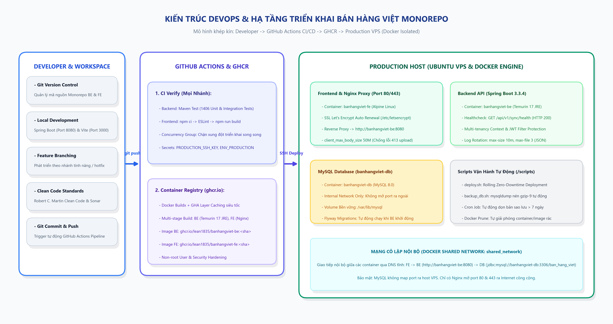
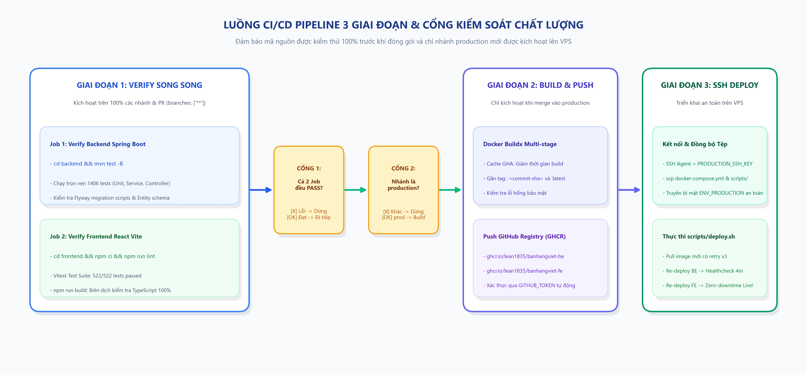
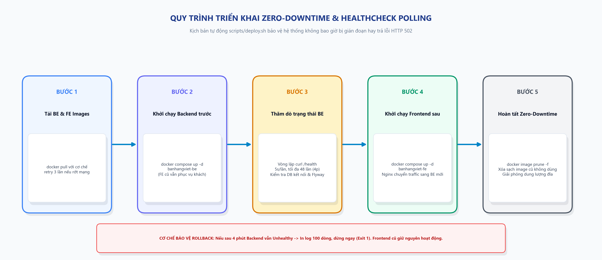

# Kiến Trúc DevOps & Hướng Dẫn Vận Hành Hạ Tầng - Bán Hàng Việt Monorepo

> **Tài liệu kỹ thuật tổng hợp toàn diện**: Containerization, Multi-Stage Builds, CI/CD Pipeline, Docker Compose Orchestration, Zero-Downtime Rolling Deployment, Tự Động Hóa Sao Lưu CSDL & An Toàn Hạ Tầng.  
> **Nguyên tắc thiết kế**: Ngắn gọn, có minh họa trực quan, chuẩn xác kỹ thuật, không văn xuôi thừa.

---

## 1. Tổng Quan Kiến Trúc DevOps & Hạ Tầng Máy Chủ

Hệ thống **Bán Hàng Việt** được xây dựng theo mô hình Monorepo kết hợp kiến trúc Container hóa khép kín trên nền tảng máy chủ đám mây Ubuntu Linux VPS. Toàn bộ quy trình từ kiểm thử, đóng gói Docker Image đến đưa lên máy chủ sản xuất được tự động hóa 100% qua GitHub Actions.



### Phân vùng trách nhiệm hạ tầng:
- **Phân vùng Phát triển (Developer Workspace)**: Lập trình viên làm việc trên mã nguồn cục bộ, chạy kiểm thử tự động, tuân thủ Clean Code và đẩy commit lên GitHub.
- **Phân vùng Tự động hóa (GitHub Actions & GHCR)**: Đảm nhiệm vai trò Continuous Integration (chạy 1406 tests backend và 522 tests frontend) và Continuous Delivery (build Docker image đa tầng, gắn tag phiên bản và lưu trữ trên GitHub Container Registry).
- **Phân vùng Máy chủ Sản xuất (Production VPS)**: Máy chủ Ubuntu 22.04 LTS chạy Docker Engine & Docker Compose. Điều phối 3 container chính: Nginx Frontend (Reverse Proxy), Spring Boot Backend (API Server) và MySQL 8.0 (Database).

### Bảng 1: Ma trận thành phần hạ tầng cốt lõi

| Thành phần | Công nghệ / Phiên bản | Vai trò và Chức năng chính |
| :--- | :--- | :--- |
| **Mã nguồn Monorepo** | Git / GitHub Repository | Quản lý tập trung cả `frontend/`, `backend/`, `scripts/`, `docs/` trên cùng một vòng đời phiên bản. |
| **CI/CD Runner** | GitHub Actions (`ubuntu-latest`) | Tự động kích hoạt test song song, build multi-stage image và kích hoạt SSH deploy. |
| **Container Registry** | GitHub Packages (`ghcr.io`) | Lưu trữ Docker Image an toàn, phân quyền riêng tư qua `GITHUB_TOKEN`, gắn tag commit-sha. |
| **Reverse Proxy / Web** | Nginx 1.25 Alpine | Điều hướng SSL/TLS (Let's Encrypt), phục vụ Single Page App React, proxy ngược `/api` về Backend. |
| **Backend Service** | Spring Boot 3.3.4 (Java 21) | Cung cấp REST API, xử lý nghiệp vụ bán hàng, quản lý phiên JWT và ngữ cảnh Đa hộ (Multi-tenancy). |
| **Database Service** | MySQL 8.0 Community | Lưu trữ dữ liệu quan hệ, cô lập trong mạng nội bộ, tự động chạy migration qua Flyway. |
| **Hạ tầng Scripts** | POSIX Shell (`/scripts`) | Điều phối triển khai Zero-Downtime (`deploy.sh`) và sao lưu CSDL xoay vòng 7 ngày (`backup_db.sh`). |

---

## 2. Container Hóa Đa Tầng (Dockerization & Multi-stage Builds)

Nhằm đạt được hiệu năng tải tối đa, giảm thiểu kích thước Docker Image và loại bỏ hoàn toàn các lỗ hổng bảo mật của môi trường biên dịch, cả Backend và Frontend đều áp dụng triệt để kỹ thuật Multi-stage Build.

### 2.1. Đóng Gói Backend Spring Boot (`backend/Dockerfile`)
- **Stage 1 (Builder)**: Sử dụng `maven:3.9-eclipse-temurin-17-alpine`. Tận dụng cơ chế layer cache bằng cách copy riêng `pom.xml` và chạy `mvn dependency:go-offline` trước khi copy toàn bộ mã nguồn `src/`. Giúp các lần build tiếp theo chỉ mất vài giây nếu không thay đổi thư viện.
- **Stage 2 (Runtime)**: Sử dụng base image siêu nhẹ `eclipse-temurin:17-jre-alpine` (~180MB). Chỉ copy duy nhất tệp `app.jar` đã đóng gói từ Stage 1 sang, loại bỏ toàn bộ công cụ Maven và mã nguồn.
- **Bảo mật Non-root User**: Tạo tài khoản `spring` và nhóm `spring` (UID 1001). Phân quyền `chown` tệp `app.jar` và chạy ứng dụng dưới quyền user này, ngăn chặn nguy cơ tấn công leo thang đặc quyền (Privilege Escalation).
- **Cấu hình Timezone**: Thiết lập biến môi trường `-Duser.timezone=Asia/Ho_Chi_Minh` đảm bảo hóa đơn điện tử, đơn hàng và báo cáo thuế luôn đồng nhất múi giờ Việt Nam (UTC+7).

### 2.2. Đóng Gói Frontend React Vite (`frontend/Dockerfile`)
- **Stage 1 (Builder)**: Sử dụng `node:20-alpine`. Chạy `npm ci` để cài đặt chính xác dependency theo `package-lock.json`, sau đó chạy `npm run build` tạo thư mục phân phối `dist/` tĩnh.
- **Stage 2 (Production Server)**: Sử dụng `nginx:1.25-alpine` (~25MB). Copy toàn bộ thư mục `dist/` vào `/usr/share/nginx/html` và nạp cấu hình tùy chỉnh `nginx.conf`.
- **Khắc phục lỗi 413 (Payload Too Large)**: Cấu hình `client_max_body_size 50M;` đồng bộ với mức 50MB của Spring Boot, phục vụ nhập file Excel lớn (10.000 hàng hóa/khách hàng) không bị gián đoạn.
- **Hỗ trợ Single Page Application (SPA)**: Khai báo `try_files $uri $uri/ /index.html;` giải quyết hoàn toàn lỗi HTTP 404 khi người dùng F5 tải lại trang tại các đường dẫn con React Router.
- **Chống lỗi CORS**: Nginx đóng vai trò Reverse Proxy điều hướng toàn bộ request `/api/` sang `http://banhangviet-be:8080`. Cả giao diện và API đều cùng chung một Domain/Port nên trình duyệt không phát sinh kiểm tra CORS pre-flight.

### Bảng 2: So sánh tối ưu hóa Container Image

| Dịch vụ | Build thông thường (Single-stage) | Multi-stage Build (Hiện tại) | Mức độ tối ưu |
| :--- | :--- | :--- | :--- |
| **Backend (Spring Boot)** | ~850 MB (Chứa cả JDK + Maven + Source) | ~220 MB (Chỉ chứa JRE + JAR thực thi) | Giảm 74% dung lượng, loại bỏ rủi ro lộ mã nguồn |
| **Frontend (React Vite)** | ~450 MB (Chứa Node_modules + Tooling) | ~32 MB (Chỉ chứa Nginx + HTML/JS minified) | Giảm 93% dung lượng, tải trang và deploy siêu tốc |
| **Thời gian Pull Image VPS** | Khoảng 60 - 90 giây | Khoảng 8 - 15 giây | Tăng tốc độ triển khai gấp 6 lần |

---

## 3. Điều Phối Mạng Nội Bộ & An Ninh Dữ Liệu (Docker Compose)

Hạ tầng ứng dụng trên máy chủ VPS được điều phối thống nhất thông qua tệp cấu hình `docker-compose.yml`:

```yaml
version: '3.8'

x-logging-options: &default-logging
  driver: 'json-file'
  options:
    max-size: '10m'
    max-file: '3'

services:
  banhangviet-be:
    container_name: banhangviet-be
    image: ${BE_IMAGE_NAME:-ghcr.io/lean1835/banhangviet-be:latest}
    restart: always
    security_opt:
      - no-new-privileges:true
    env_file:
      - ./backend/.env
    networks:
      - shared_network
    logging: *default-logging

  banhangviet-fe:
    container_name: banhangviet-fe
    image: ${FE_IMAGE_NAME:-ghcr.io/lean1835/banhangviet-fe:latest}
    ports:
      - '${FE_PORT:-80}:80'
      - '443:443'
    volumes:
      - /etc/letsencrypt:/etc/letsencrypt:ro
      - /var/www/certbot:/var/www/certbot:ro
    depends_on:
      - banhangviet-be
    restart: always
    logging: *default-logging

networks:
  shared_network:
    name: default_network
    external: true
```

### Nguyên tắc an toàn hạ tầng:
1. **Cô lập mạng nội bộ (Internal Isolated Network)**: Toàn bộ container gia nhập `shared_network` (`default_network`). Backend kết nối CSDL MySQL qua DNS nội bộ `banhangviet-db:3306`. CSDL MySQL tuyệt đối không mở port ra Internet công cộng, ngăn chặn 100% các cuộc quét cổng và tấn công Brute-force từ bên ngoài.
2. **Cơ chế chống tràn dung lượng đĩa (Log Rotation)**: Áp dụng cấu hình mặc định `driver: 'json-file'` với giới hạn cứng `max-size: '10m'` và `max-file: '3'`. Đảm bảo log của mỗi container không bao giờ vượt quá 30MB, loại trừ nguy cơ VPS bị tê liệt do đầy ổ cứng.
3. **Lưu trữ bền vững (Persistent Storage)**: Dữ liệu CSDL MySQL được gắn kết vào Docker Volume `/var/lib/mysql`. Mọi hoạt động cập nhật phần mềm, tái khởi động container hay re-deploy đều không gây mất mát dữ liệu.
4. **Bảo mật phân quyền (No New Privileges)**: Khai báo cờ bảo mật `security_opt: [no-new-privileges:true]` ngăn chặn mọi tiến trình bên trong container tự động nâng quyền lên root của máy chủ host.

---

## 4. Quy Trình CI/CD Tự Động Hóa (GitHub Actions Pipeline)

Chuỗi tự động hóa CI/CD được thiết lập qua tệp `.github/workflows/deploy.yml` với triết lý: 100% minh bạch, kiểm thử toàn diện mọi nhánh và chỉ cho phép đưa code lên Production khi toàn bộ kiểm thử đạt chuẩn tuyệt đối.



### 3 Giai đoạn thực thi trong CI/CD Pipeline:
- **Giai đoạn 1: Verify Song Song (Mọi nhánh & Pull Request)**:
  - Khi có bất kỳ commit push hoặc PR mở vào bất kỳ nhánh nào, GitHub Actions khởi chạy song song 2 máy ảo:
    - **Job 1 (Backend)**: `cd backend && mvn test -B` (Chạy toàn bộ 1406 test cases backend và migration Flyway).
    - **Job 2 (Frontend)**: `cd frontend && npm ci && npm run lint`, Vitest (522 test cases) và `npm run build` (kiểm tra TypeScript).
  - **Quality Gate 1**: Nếu có bất kỳ lỗi nào, pipeline lập tức Báo đỏ, chặn Merge PR và không build Docker Image.
- **Giai đoạn 2: Build & Push Docker Image (Chỉ nhánh production)**:
  - Khi mã nguồn được duyệt và hợp nhất vào nhánh `production`, Stage 2 kích hoạt Docker Buildx với bộ nhớ đệm GitHub Cache.
  - Đóng gói 2 images gắn thẻ định danh SHA commit và `:latest`, sau đó đẩy lên GitHub Container Registry (`ghcr.io`).
- **Giai đoạn 3: SSH Rolling Deploy lên VPS**:
  - Sử dụng `ssh-agent` nạp khóa bí mật `PRODUCTION_SSH_KEY` kết nối trực tiếp vào máy chủ VPS.
  - Đồng bộ `docker-compose.yml`, tệp kịch bản `scripts/*.sh`, nạp file cấu hình bảo mật `ENV_PRODUCTION` và kích hoạt `scripts/deploy.sh`.

---

## 5. Kịch Bản Triển Khai Zero-Downtime & Vận Hành Trên VPS

Tính năng ấn tượng nhất của hạ tầng DevOps Bán Hàng Việt là khả năng triển khai ứng dụng mà không gây gián đoạn dịch vụ (Zero-Downtime) thông qua kịch bản điều phối tự động `scripts/deploy.sh` trên VPS.



### 5.1. Quy trình 5 bước thực thi trong `scripts/deploy.sh`:
1. **Bước 1: Tải Docker Images với cơ chế Thử lại (Retry)**: Script gọi `docker pull` cho cả BE và FE với hàm bọc retry tối đa 3 lần, delay 5 giây giữa các lần nhằm chống lỗi rớt mạng.
2. **Bước 2: Khởi chạy lại Backend Container trước**: Chạy `docker compose up -d banhangviet-be`. Lúc này, container Frontend cũ vẫn đang hoạt động bình thường và phục vụ người dùng.
3. **Bước 3: Vòng lặp thăm dò sức khỏe (Healthcheck Polling)**: Script thực hiện vòng lặp 48 lần (mỗi lần cách nhau 5 giây, tối đa 240 giây = 4 phút) kiểm tra trạng thái sức khỏe qua lệnh `docker inspect --format='{{.State.Health.Status}}'`. Điểm kiểm tra là API `/api/v1/sync/health` của Backend (xác nhận kết nối CSDL thành công và Flyway đã chạy xong).
4. **Bước 4: Khởi chạy Frontend Container sau**: Chỉ khi Backend báo `healthy` (HTTP 200), script mới khởi chạy `docker compose up -d banhangviet-fe`. Nginx khởi động lại chỉ mất 1-2 giây và lập tức chuyển tiếp người dùng sang Backend phiên bản mới. Người dùng hoàn toàn không gặp lỗi HTTP 502 Bad Gateway.
5. **Bước 5: Tự động dọn dẹp tài nguyên thừa**: Chạy `docker image prune -f` giải phóng ngay lập tức các layer image cũ, giữ cho dung lượng ổ đĩa VPS luôn sạch sẽ.

### 5.2. Kịch Bản Tự Động Sao Lưu Dữ Liệu (`scripts/backup_db.sh`)
Để phòng chống thảm họa mất mát dữ liệu, dự án trang bị kịch bản sao lưu CSDL tự động và xoay vòng tệp:
- **Xuất dữ liệu an toàn**: Chạy lệnh `mysqldump --single-transaction --quick` trực tiếp từ container `banhangviet-db`. Không gây khóa bảng (table lock), đảm bảo hoạt động bán hàng POS vẫn diễn ra bình thường trong lúc sao lưu.
- **Nén dữ liệu mức tối đa**: Dữ liệu xuất ra được nén trực tiếp qua đường ống `gzip -9` giúp giảm hơn 85% dung lượng lưu trữ.
- **Tự động xoay vòng 7 ngày (Retention Policy)**: Lệnh `find "$BACKUP_DIR" -name "db_*.sql.gz" -type f -mtime +7 -delete` tự động dọn sạch các bản backup cũ hơn 7 ngày, cân bằng hoàn hảo giữa an toàn dữ liệu và dung lượng ổ cứng.

---

## 6. Quản Trị Bí Mật & An Ninh Hạ Tầng (Secrets Audit)

Tuyệt đối không lưu trữ mật khẩu, khóa bí mật hay chứng chỉ bảo mật trong mã nguồn Git công khai. Mọi thông tin nhạy cảm được quản lý qua GitHub Repository Secrets.

### Bảng 3: Ma trận kê khai biến bí mật

| Tên Biến Bí Mật (Secret) | Môi trường lưu trữ | Mục đích sử dụng & Biện pháp bảo vệ |
| :--- | :--- | :--- |
| `PRODUCTION_IP` | GitHub Actions Secret | Địa chỉ IP tĩnh của máy chủ VPS. Chỉ nạp vào phiên chạy SSH của CI/CD runner. |
| `PRODUCTION_USER` | GitHub Actions Secret | Tên tài khoản người dùng Linux trên VPS (ví dụ: `ubuntu`). |
| `PRODUCTION_SSH_KEY` | GitHub Actions Secret | Cặp khóa SSH Private Key ED25519 được mã hóa, không sử dụng mật khẩu truy cập SSH thông thường. |
| `ENV_PRODUCTION` | GitHub Actions Secret | Toàn bộ chuỗi cấu hình biến môi trường Backend (`DB_PASSWORD`, `JWT_SECRET`, `GEMINI_API_KEY`...). |
| `GITHUB_TOKEN` | GitHub Auto Generated | Token tự động cấp với quyền ghi `packages:write` dùng để đăng nhập và push image lên GHCR. |

### Cơ chế truyền bí mật chống lộ lề:
Thay vì ghi bí mật vào command line hoặc lưu file tạm trên runner, chuỗi `ENV_PRODUCTION` được truyền trực tiếp qua stdin của kết nối mã hóa SSH:
```bash
printf '%s\n' "$ENV_PRODUCTION" | ssh ... "cat > $DEPLOY_PATH/backend/.env"
```
Cách làm này ngăn chặn 100% việc rò rỉ secret trong bash history hay log của runner.

---

## 7. Sổ Tay Vận Hành & Khắc Phục Sự Cố Khẩn Cấp (Runbook)

### Bảng 4: Sổ tay tra cứu lệnh vận hành máy chủ VPS

| Nhu cầu vận hành | Câu lệnh thực thi trên VPS | Mục đích kiểm tra |
| :--- | :--- | :--- |
| **Xem log Backend trực tiếp** | `docker logs -f --tail 100 banhangviet-be` | Theo dõi hoạt động xử lý API, truy vấn CSDL và lỗi ngoại lệ nếu có. |
| **Xem log Nginx Frontend** | `docker logs -f --tail 50 banhangviet-fe` | Kiểm tra lưu lượng truy cập HTTP, mã trạng thái 200/404/500. |
| **Kiểm tra sức khỏe container** | `docker inspect --format='{{.State.Health.Status}}' banhangviet-be` | Xác nhận trạng thái trả về `healthy`. |
| **Kiểm tra tài nguyên RAM/CPU** | `docker stats --no-stream` | Đảm bảo container không bị tràn RAM hoặc nghẽn CPU. |
| **Chạy sao lưu CSDL ngay** | `/bin/sh ~/banhangviet-deployment/scripts/backup_db.sh` | Tạo ngay 1 bản snapshot CSDL nén gzip tại thư mục `backups/`. |
| **Dọn dẹp rác hệ thống** | `docker system prune -f` | Xóa các container đã dừng, network không dùng và dangling images. |

### 7.2. Quy Trình Khôi Phục (Rollback) Khẩn Cấp Trong 30 Giây

Trong trường hợp phiên bản mới được deploy thành công nhưng phát sinh lỗi logic nghiệp vụ nghiêm trọng, người quản trị có thể rollback về phiên bản ổn định trước đó bằng đúng 1 câu lệnh duy nhất:

```bash
# Đăng nhập vào VPS và chạy lệnh Rollback với commit SHA phiên bản ổn định cũ:
cd ~/banhangviet-deployment
BE_IMAGE_NAME="ghcr.io/lean1835/banhangviet-be:5f8ddd75" \
FE_IMAGE_NAME="ghcr.io/lean1835/banhangviet-fe:5f8ddd75" \
DEPLOY_PATH="$PWD" \
/bin/sh scripts/deploy.sh
```
*Tất cả các bản build trước đó đều được lưu trữ vĩnh viễn và gắn tag theo Commit SHA trên GitHub Container Registry, cho phép rollback tức thời mà không cần build lại mã nguồn.*
