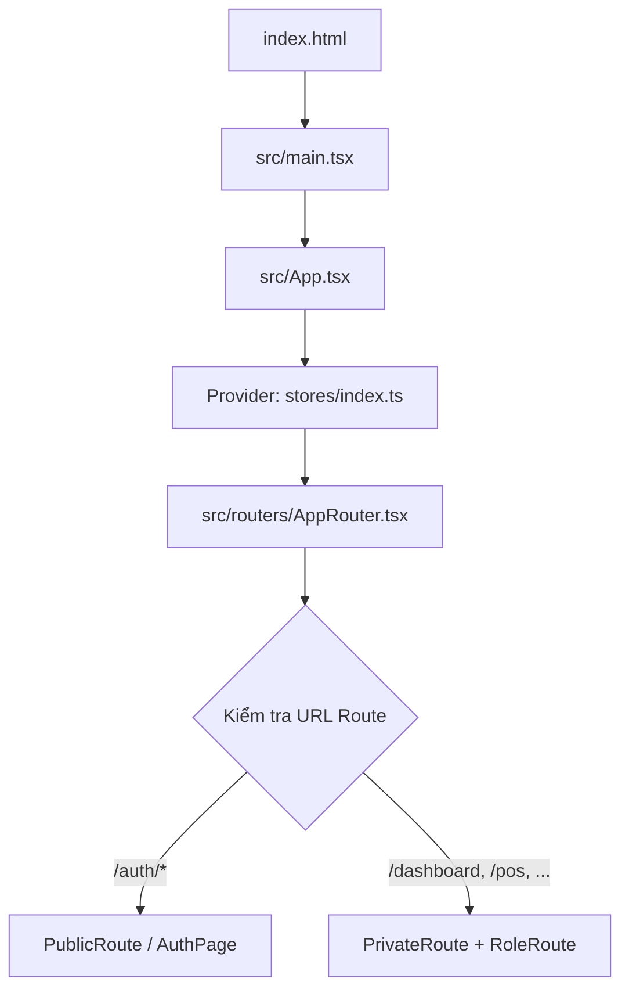
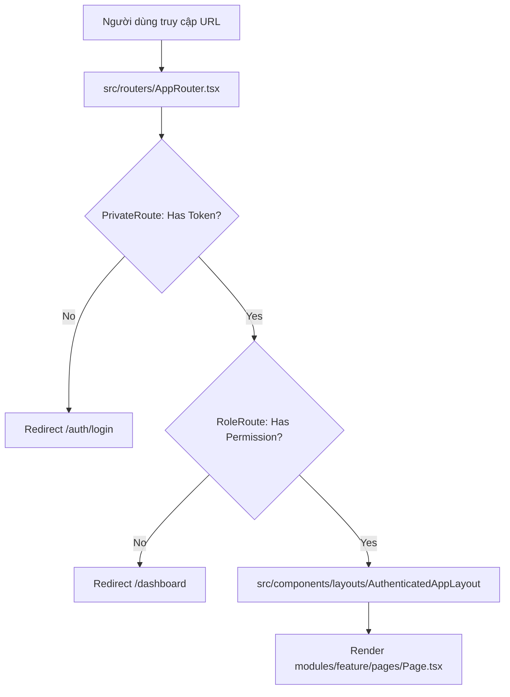
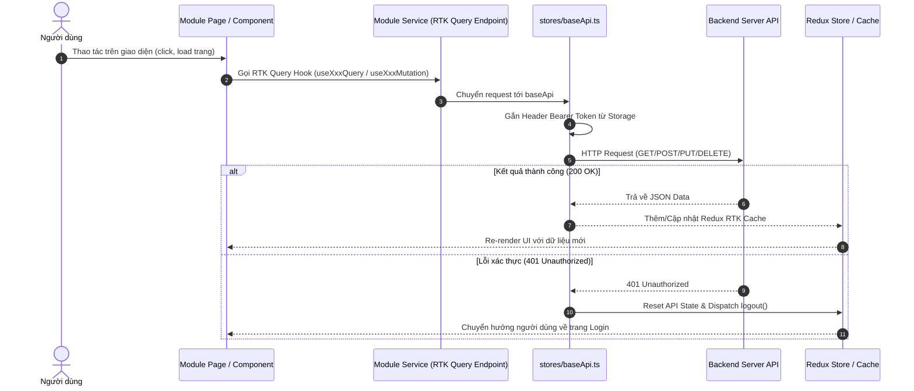

# Phân Tích Cấu Trúc Thư Mục & Luồng Hoạt Động Frontend

Tài liệu này tổng hợp cấu trúc thư mục, chức năng của từng thư mục, mối quan hệ giữa chúng và sơ đồ luồng hoạt động của dự án Frontend **Bán Hàng Việt**.

---

## 1. Cấu Trúc Tổng Quan Thư Mục Frontend (`src/`)

Dự án được xây dựng theo kiến trúc **Feature-First / Modular Architecture** kết hợp với **Redux Toolkit (RTK Query)** và **React Router v6**.

```text
frontend/src/
├── assets/         # Tài nguyên tĩnh (hình ảnh, icon, SVG, font)
├── components/     # UI Component toàn cục (Layouts, UI Kit dùng chung)
│   ├── common/     # Các UI Control nhỏ dùng chung (Button, Input, Modal, Table...)
│   └── layouts/    # Khung giao diện chính (AuthenticatedAppLayout, Header, Navigation...)
├── configs/        # Cấu hình hệ thống chung
├── constants/      # Tất cả hằng số (API endpoints, Routes, Roles, App settings...)
├── hooks/          # React Custom Hooks toàn cục (useRedux, useDebounce...)
├── modules/        # CÁC MODULE NGHIỆP VỤ CHÍNH (Feature Modules - Trọng tâm dự án)
│   ├── auth/       # Xác thực & Đăng nhập
│   ├── product/    # Quản lý Sản phẩm & Nhập kho
│   ├── pos/        # Điểm bán hàng (Point of Sale)
│   ├── order/      # Quản lý Hóa đơn & Đơn hàng
│   ├── shift/      # Quản lý Ca làm việc
│   ├── customer/   # Quản lý Khách hàng
│   ├── employee/   # Quản lý Nhân viên
│   ├── report/     # Báo cáo doanh thu & Hoạt động
│   ├── settings/   # Cấu hình cửa hàng, thuế, máy in
│   ├── platform_admin/  # Quản trị hệ thống (Admin)
│   └── tax_authority/   # Kết nối Cơ quan Thuế
├── pages/          # Các trang cấp cao / Wrapper (ví dụ AuthPage.tsx)
├── providers/      # Các React Context Provider toàn cục hoặc theo cụm
├── routers/        # Điều hướng hệ thống (AppRouter & Guards phân quyền)
├── stores/         # Quản lý State toàn cục Redux Toolkit & RTK Query Base API
├── utils/          # Các hàm tiện ích dùng chung (Format tiền tệ, ngày tháng...)
├── App.tsx         # Root Component (Bao bọc Store Provider & Router)
└── main.tsx        # Entrypoint khởi chạy ứng dụng React với DOM
```

---

## 2. Chi Tiết Chức Năng Từng Thư Mục

### 🏢 1. `src/modules/` (Thư mục trung tâm nghiệp vụ)
Được thiết kế theo nguyên tắc **Tách biệt nghiệp vụ (Isolation)** (chi tiết tại [modules/README.md](file:///d:/Intern/Codegym/BanHangViet/frontend/src/modules/README.md)). Mỗi module đại diện cho một miền chức năng riêng biệt (`auth`, `product`, `pos`, `order`, v.v.) và có cấu trúc nội bộ chuẩn:
- **`services/`**: Chứa RTK Query Endpoints dùng để gọi API liên quan riêng tới module đó (sử dụng `baseApi.injectEndpoints`).
- **`pages/`**: Các trang giao diện chính của module.
- **`components/`**: Các UI Component nhỏ chỉ phục vụ riêng cho module đó.
- **`types/`**: Định nghĩa TypeScript interface/type riêng của module.
- **`utils/`**: Hàm helper xử lý dữ liệu đặc thù riêng cho module.

### 🎨 2. `src/components/` (Tầng Giao diện dùng chung)
- **`common/`**: Chứa các component tái sử dụng ở nhiều nơi (như Button, Modal, DataTable, Input, Loading spinner...). Không chứa logic nghiệp vụ đặc thù.
- **`layouts/`**: Chứa bố cục khung của ứng dụng như [AuthenticatedAppLayout.tsx](file:///d:/Intern/Codegym/BanHangViet/frontend/src/components/layouts/AuthenticatedAppLayout.tsx), `DashboardNavigation.tsx`, `DashboardUtilityBar.tsx`.

### 🧭 3. `src/routers/` (Tầng Điều hướng & Phân quyền)
- **[AppRouter.tsx](file:///d:/Intern/Codegym/BanHangViet/frontend/src/routers/AppRouter.tsx)**: Khai báo toàn bộ bản đồ Route của ứng dụng, kết hợp Lazy Loading (`React.lazy`) giúp tối ưu hiệu năng.
- **`guards/`**: 
  - `PublicRoute`: Cho phép truy cập khi chưa đăng nhập (trang Auth/Login).
  - `PrivateRoute`: Đảm bảo phải có Token xác thực mới được vào hệ thống.
  - `RoleRoute`: Kiểm tra vai trò tài khoản (`normal_management`, `point_of_sale`, `platform_admin`, `tax_authority`...) trước khi cho phép vào màn hình tương ứng.

### 🗄️ 4. `src/stores/` (Tầng Quản lý State & Network Central Hub)
- **[baseApi.ts](file:///d:/Intern/Codegym/BanHangViet/frontend/src/stores/baseApi.ts)**: Cấu hình `fetchBaseQuery` trung tâm cho RTK Query: tự động gắn `Authorization: Bearer <token>` vào mọi HTTP Request, đồng thời tự động đăng xuất (`logout`) và làm sạch cache nếu nhận phản hồi `401 Unauthorized`.
- **[authSlice.ts](file:///d:/Intern/Codegym/BanHangViet/frontend/src/stores/authSlice.ts)**: Quản lý State xác thực (User info, Access Token, Login Status).
- **[index.ts](file:///d:/Intern/Codegym/BanHangViet/frontend/src/stores/index.ts)**: Khai báo Redux Store chính của ứng dụng.

### ⚙️ 5. Các thư mục hỗ trợ khác
- **`src/constants/`**: Chứa hằng số hệ thống ([routes.ts](file:///d:/Intern/Codegym/BanHangViet/frontend/src/constants/routes.ts), [roles.ts](file:///d:/Intern/Codegym/BanHangViet/frontend/src/constants/roles.ts), [api.ts](file:///d:/Intern/Codegym/BanHangViet/frontend/src/constants/api.ts)...).
- **`src/utils/`**: Xử lý định dạng dữ liệu dùng chung (`formatCurrency.ts`, `dateFormatter.ts`, `getApiErrorMessage.ts`).
- **`src/hooks/`**: Custom hooks dùng chung như `useRedux` (typed hooks `useAppDispatch`, `useAppSelector`), `useDebounce`.
- **`src/providers/`**: Chứa Context Providers toàn cục (như `DashboardDemoProvider.tsx`).

---

## 3. Mối Quan Hệ & Phụ Thuộc Giữa Các Thư Mục

Mối quan hệ phụ thuộc giữa các thư mục đi theo **chiều từ dưới lên (Tầng cơ sở ➔ Tầng Nghiệp vụ ➔ Tầng Hiển thị & Điều hướng)**:

```text
[constants / utils / types] (Tầng cơ sở - Không phụ thuộc ai)
         ▲
         │
[stores/baseApi & authSlice] (Tầng State & HTTP Core)
         ▲
         │
[modules/*/services] (Tầng API Endpoints Nghiệp vụ - Inject vào baseApi)
         ▲
         │
[components/common & layouts] (Tầng UI Kit & Frame)
         ▲
         │
[modules/*/pages & components] (Tầng Giao diện Nghiệp vụ)
         ▲
         │
[routers & guards] (Tầng Phân quyền & Điều hướng Route)
         ▲
         │
[App.tsx & main.tsx] (Tầng Khởi chạy Root)
```

---

## 4. Sơ Đồ Luồng Hoạt Động (Flow Diagrams)

### 🚀 Luồng 1: Khởi chạy Ứng dụng (Initialization & Bootstrapping Flow)

**Mô tả văn bản:**
1. Trình duyệt nạp `index.html` ➔ gọi [main.tsx](file:///d:/Intern/Codegym/BanHangViet/frontend/src/main.tsx).
2. [main.tsx](file:///d:/Intern/Codegym/BanHangViet/frontend/src/main.tsx) mount [App.tsx](file:///d:/Intern/Codegym/BanHangViet/frontend/src/App.tsx) vào DOM root.
3. [App.tsx](file:///d:/Intern/Codegym/BanHangViet/frontend/src/App.tsx) cung cấp Redux Store (`Provider store={store}`) cho toàn ứng dụng và gọi [AppRouter](file:///d:/Intern/Codegym/BanHangViet/frontend/src/routers/AppRouter.tsx).
4. [AppRouter](file:///d:/Intern/Codegym/BanHangViet/frontend/src/routers/AppRouter.tsx) kích hoạt `BrowserRouter` và kiểm tra đường dẫn URL hiện tại.



---

### 🔐 Luồng 2: Điều hướng & Kiểm tra Phân quyền (Routing & Auth Guard Flow)

**Mô tả văn bản:**
1. Khi người dùng truy cập một URL (ví dụ `/pos` hoặc `/products`):
2. `AppRouter` dẫn request qua **`PrivateRoute`**:
   - `PrivateRoute` đọc `token` từ `authSlice` hoặc `localStorage`.
   - Nếu chưa đăng nhập ➔ Redirect về `/auth/login`.
3. Nếu đã đăng nhập, request đi tiếp qua **`RoleRoute`**:
   - `RoleRoute` kiểm tra `user.role` từ Redux Store có nằm trong danh sách `allowedRoles` của trang đó không.
   - Nếu không đủ quyền ➔ Chuyển hướng hoặc chặn truy cập.
4. Khi vượt qua kiểm tra, ứng dụng nạp [AuthenticatedAppLayout](file:///d:/Intern/Codegym/BanHangViet/frontend/src/components/layouts/AuthenticatedAppLayout.tsx) và render Page nghiệp vụ tương ứng (`modules/[feature]/pages`).



---

### 🔄 Luồng 3: Xử lý Dữ liệu & Tương tác API (Data Fetching & State Flow)

**Mô tả văn bản:**
1. Người dùng thao tác trên màn hình (ví dụ: bấm nút "Tạo đơn hàng" ở `modules/pos/pages/PosPage.tsx` hoặc mở trang danh sách sản phẩm `ProductListPage.tsx`).
2. Component trong `modules/[feature]/pages` hoặc `components` gọi một **RTK Query Hook** (ví dụ `useGetProductsQuery` hoặc `useCreateOrderMutation`) được định nghĩa trong `modules/[feature]/services/`.
3. Service truyền Request đến **[baseApi.ts](file:///d:/Intern/Codegym/BanHangViet/frontend/src/stores/baseApi.ts)**:
   - [baseApi.ts](file:///d:/Intern/Codegym/BanHangViet/frontend/src/stores/baseApi.ts) lấy Access Token từ `localStorage` và tự động đính kèm Header `Authorization: Bearer <token>`.
   - Gửi HTTP Request sang Backend REST API.
4. **Phản hồi từ Backend:**
   - Nếu **200 OK**: RTK Query lưu kết quả vào Redux Cache, tự động re-render UI với dữ liệu mới.
   - Nếu **401 Unauthorized**: [baseApi.ts](file:///d:/Intern/Codegym/BanHangViet/frontend/src/stores/baseApi.ts) tự động xóa API State, dispatch action `logout()` trong `authSlice`, điều hướng người dùng về trang đăng nhập.



---

## 🛠️ Đánh Giá Tổng Kết

1. **Kiến trúc Modular mở rộng tốt**: Nhờ phân chia theo Feature (`src/modules/`), việc thêm chức năng mới hoàn toàn độc lập và không gây ảnh hưởng tới các thành phần hiện có.
2. **Xử lý Network & Auth tập trung**: `baseApi.ts` đóng vai trò cổng kết nối duy nhất, giúp quản lý Bearer Token và 401 Auto Logout tự động, minh bạch.
3. **Phân quyền tuyến đường chặt chẽ**: Đảm bảo phân tách giữa người dùng bình thường, thu ngân POS, quản lý cửa hàng, admin hệ thống và cơ quan thuế.
